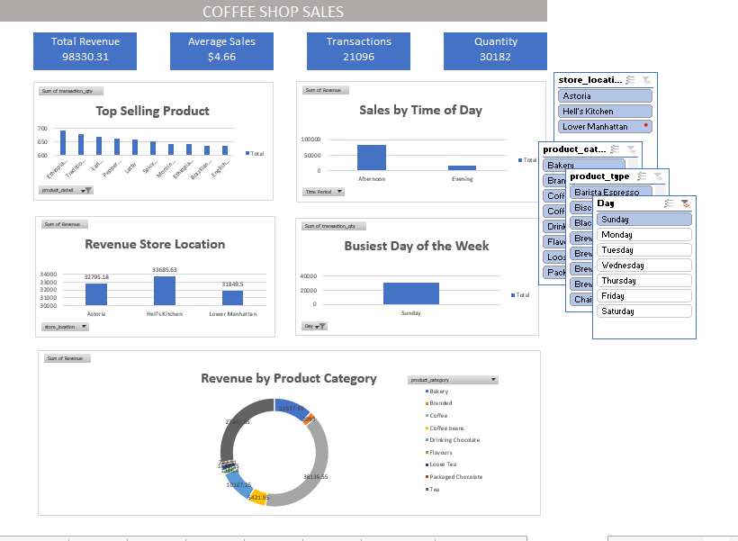

# ☕ Coffee Shop Sales Dashboard

## About the Project 

This project analyzes coffee shop sales data using Microsoft Excel. The goal was to transform raw sales data into an interactive dashboard that provides valuable business insights for decision-making.

## Objectives

- Clean and prepare the sales data.
- Understand how sales are performing.
- Identify top-selling products.
- Compare sales across different locations.
- Track how sales changed month by month.
- Present everything in a clear, interactive Excel Dashboard.

## Tools i Used

- Microsoft Excel
- Pivot Tables
- Pivot Charts
- Slicers
- Conditional Formatting

## About the Dataset

The dataset contains coffee shop transaction records, including:

- Transaction Date
- Store Location
- Product Category
- Product Name
- Quantity Sold
- Unit Price
- Total Sales

## Dashboard Features

The dashboard includes:

- 📅 Monthly Sales Trend
- 📍 Sales by Store Location
- ☕ Top-Selling Products
- 📦 Sales by Product Category
- 💰 Total Revenue
- 🔎 Interactive Slicers for easy filtering

## Key Insights

- Identified the best-performing store location.
- Determined the highest-selling products.
- Revealed monthly sales trends.
- Compared sales performance across product categories.

## Files Included

- `Coffee Shop Sales Dataset.xlsx` – Raw dataset
- `Coffee Shop Sales Dashboard.xlsx` – Completed Excel dashboard
- `Dashboard.png` – Screenshot of the dashboard
- `README.md` – Project documentation

## Dashboard Preview

## Author

**Hudu Yusuf Ibrahim**

Aspiring Data Analyst passionate about using data to solve problems.

---

⭐ If you found this project interesting, feel free to star this repository!