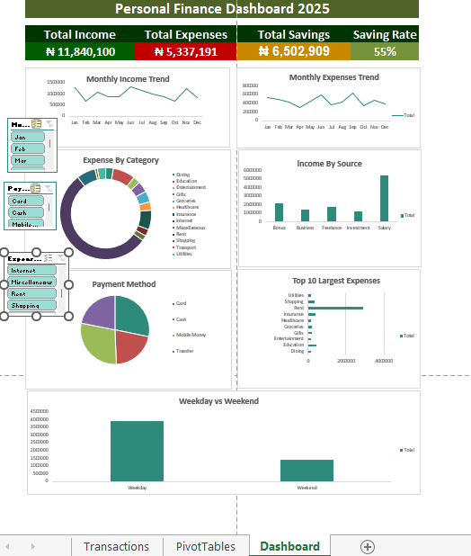

# 💰 Personal Finance Dashboard (Excel)

## 📌 Project Overview

This project analyzes personal financial transactions over one year to help an individual understand income, expenses, savings, and spending habits. An interactive Excel dashboard was created using PivotTables, PivotCharts, KPI cards, and slicers to provide meaningful financial insights.

---

## 🎯 Business Problem

Individuals often struggle to track their finances and identify spending patterns. This dashboard provides a clear overview of financial performance and supports better budgeting and savings decisions.

---

## 📊 Dashboard Features

- Total Income
- Total Expenses
- Total Savings
- Savings Rate
- Monthly Income Trend
- Monthly Expense Trend
- Expense by Category
- Income by Source
- Spending by Payment Method
- Top 10 Largest Expenses
- Weekday vs Weekend Spending
- Interactive Slicers

---

## 🛠 Tools Used

- Microsoft Excel
- PivotTables
- PivotCharts
- Slicers
- Excel Tables
- SUMIFS
- IF
- TEXT
- WEEKDAY
- Conditional Formatting

---

## 📈 Key Insights

- Annual income exceeded annual expenses, resulting in positive savings.
- Salary was the largest source of income.
- Spending patterns varied across expense categories.
- Payment methods showed how expenses were distributed.
- The dashboard enables quick filtering using slicers for interactive analysis.

---

## 📂 Files Included

- Personal_Finance_Dashboard.xlsx
- Personal_Finance_Data_Balanced.xlsx
- Dashboard Screenshots

---
## Dashboard Preview

## 👤 Author

**Hudu Yusuf Ibrahim**

Aspiring Data Analyst

GitHub: https://github.com/01Yusufh
