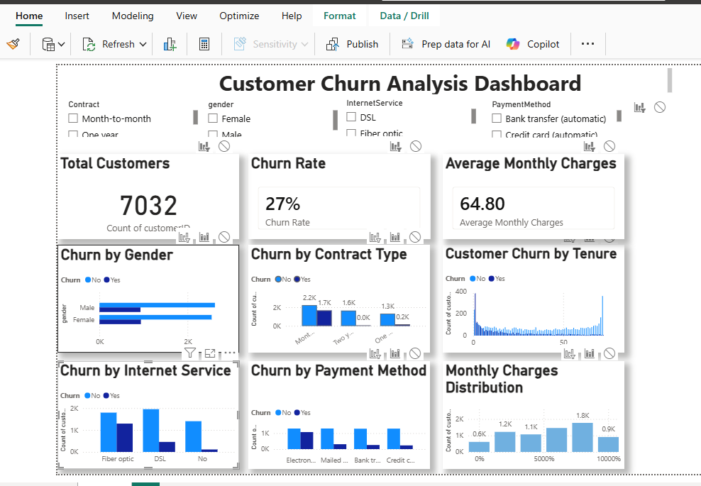
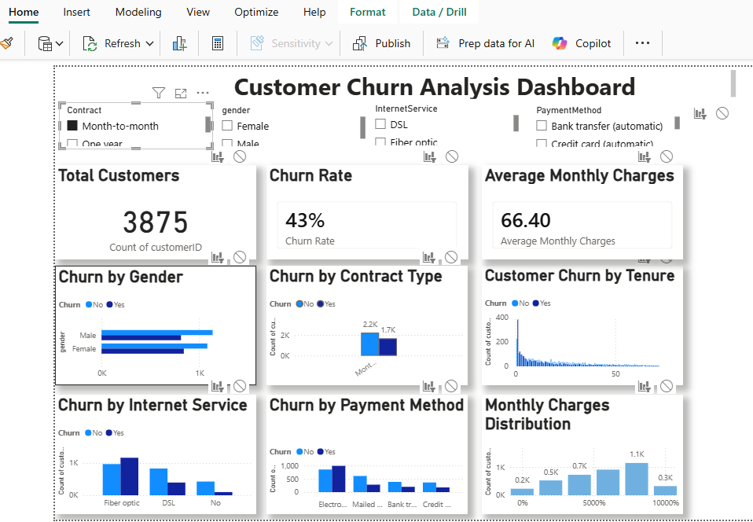

# 📊 Customer Churn Analysis Dashboard 


## 📌 Project Overview

Customer churn is one of the biggest challenges for subscription-based businesses. This project analyzes customer behavior using Power BI to identify patterns that contribute to customer churn.

The dashboard provides interactive visualizations that help stakeholders understand churn trends based on customer demographics, contract type, internet service, payment method, tenure, and monthly charges.

---

## 🎯 Project Objectives

- Analyze the overall customer churn rate.
- Identify which customer groups are more likely to churn.
- Compare churn across different contract types.
- Analyze churn by internet service and payment method.
- Explore customer tenure and monthly charges.
- Build an interactive dashboard for business decision-making.

---

## 🛠 Tools Used

- Microsoft Power BI
- Power Query
- DAX (Data Analysis Expressions)
- CSV Dataset

---

## 📂 Dataset

**Dataset:** Telco Customer Churn Dataset

The dataset contains customer information including:

- Customer ID
- Gender
- Contract Type
- Internet Service
- Payment Method
- Monthly Charges
- Tenure
- Churn Status

---

## 📊 Dashboard Features

### KPI Cards

- Total Customers
- Churn Rate
- Average Monthly Charges

### Interactive Slicers

- Contract
- Gender
- Internet Service
- Payment Method

### Visualizations

- Churn by Gender
- Churn by Contract Type
- Customer Churn by Tenure
- Churn by Internet Service
- Churn by Payment Method
- Monthly Charges Distribution

---

## 📸 Dashboard Preview

### Main Dashboard





### Filtered Dashboard





---


## 📈 Key Business Insights

- Approximately **27%** of customers have churned.
- Customers on **month-to-month contracts** have a significantly higher churn rate than those on one-year or two-year contracts.
- Customers using **Fiber Optic internet service** experience higher churn than customers using DSL.
- Customers with **shorter tenure** are more likely to churn, while long-term customers tend to remain with the company.
- Customers who pay using **electronic checks** experience the highest churn, with more customers leaving than staying. In contrast, customers using automatic bank transfers or automatic credit card payments show much lower churn.
- Most customers fall within the **middle-to-high monthly charge ranges**, indicating that a large portion of the customer base subscribes to higher-priced service plans.
---

## 💡 Skills Demonstrated

- Data Cleaning using Power Query
- Data Modeling
- DAX Measures
- KPI Development
- Interactive Dashboard Design
- Business Intelligence Reporting
- Data Visualization
- Business Insight Generation

---

## 📁 Project Structure

```
customer-churn-analysis-powerbi/
│
├── README.md
├── Customer_Churn_Analysis.pbix
│
├── dataset/
│   └── Telco_Customer_Churn_Dataset.csv
│
└── screenshots/
    ├── dashboard-overview.png
    └── dashboard-filtered.png
```

---

## 🚀 How to Use

1. Download the repository.
2. Open `Customer_Churn_Analysis.pbix` using Microsoft Power BI Desktop.
3. Interact with the slicers to explore customer churn across different customer segments.
4. Review the visualizations and business insights.

---

## 📚 Learning Outcomes

This project strengthened my skills in:

- Power BI Dashboard Development
- Data Transformation with Power Query
- DAX Calculations
- Interactive Reporting
- Business Data Analysis
- Dashboard Design Best Practices

---
## 🙏 Acknowledgements

This project was completed as part of my Data Analytics learning journey to strengthen my Power BI, data visualization, and business intelligence skills by analyzing a real-world customer churn dataset.

The project focuses on applying data cleaning, DAX calculations, interactive dashboard design, and business insight generation using Microsoft Power BI.
## 👨‍💻 Author

**Hudu Yusuf Ibrahim**

Aspiring Data Analyst passionate about transforming data into meaningful business insights.

- GitHub: [01Yusufh](https://github.com/01Yusufh)
- LinkedIn: [Hudu Yusuf Ibrahim](https://www.linkedin.com/in/hudu-yusuf-ibrahim-ba06b5365/)

---
