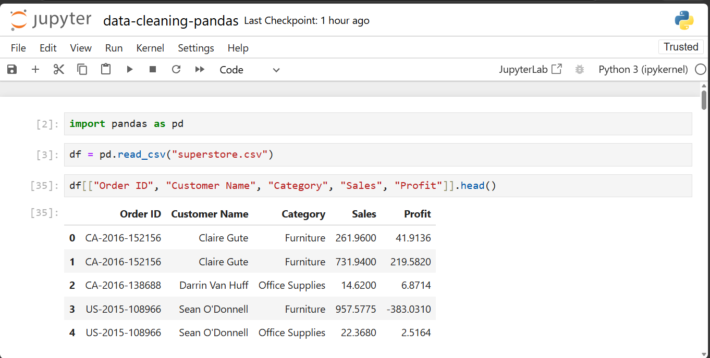
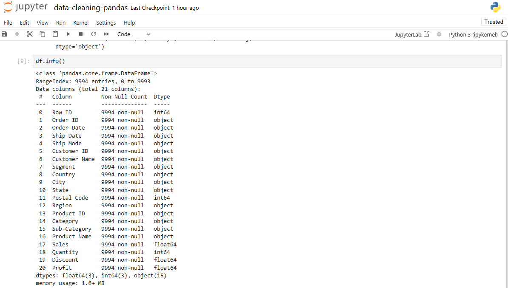
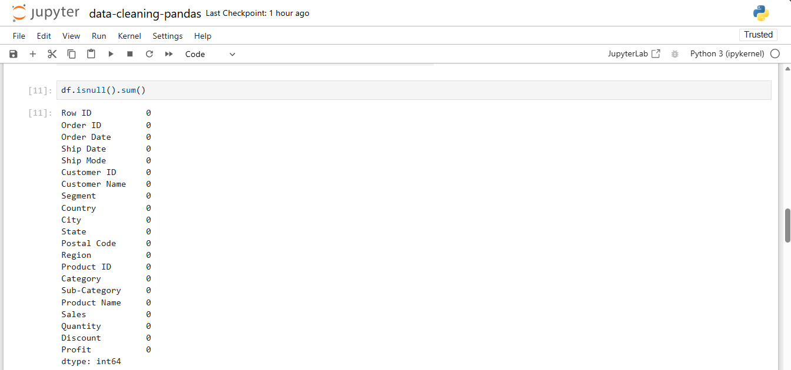
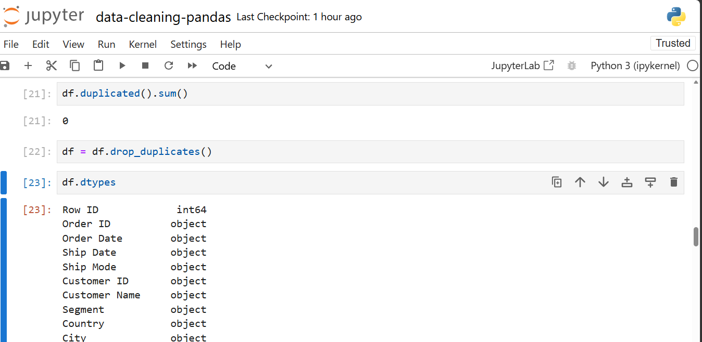
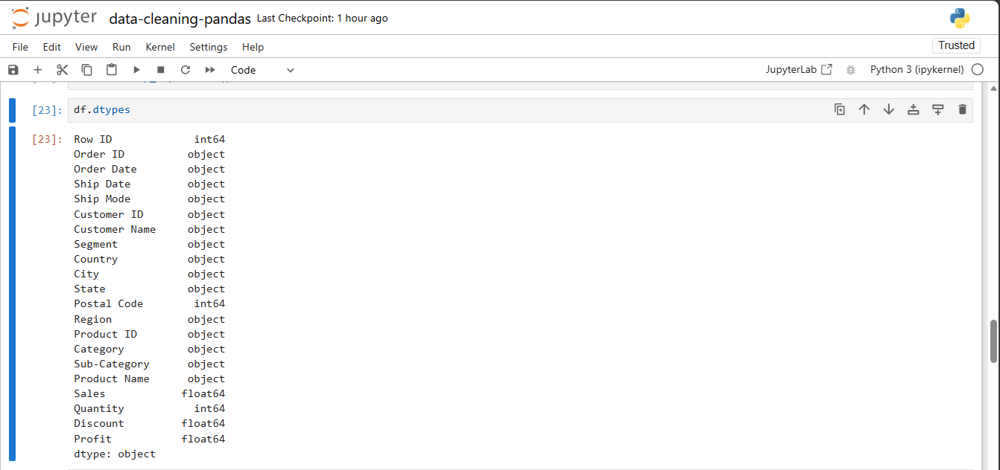
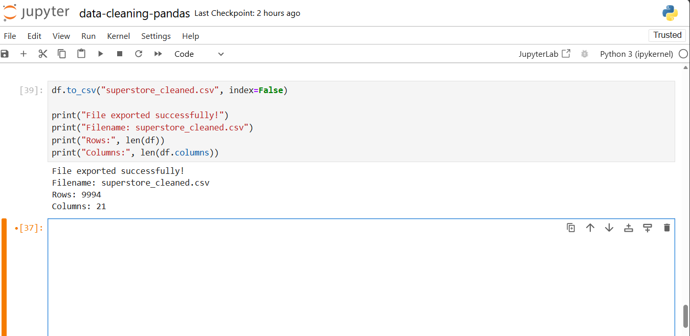

# 🐍 Data Cleaning with Pandas


## 📌 Project Overview

This project demonstrates the data cleaning process using **Python** and **Pandas**. The objective was to inspect the dataset, identify potential data quality issues, clean the data, and export a cleaned version ready for analysis.

Data cleaning is a critical step in the data analysis workflow because it improves data quality and ensures reliable insights.

---

## 🎯 Objectives

- Load a CSV dataset into Python
- Inspect the dataset structure
- Check for missing values
- Detect and remove duplicate records
- Verify and inspect data types
- Export the cleaned dataset for further analysis

---

## 🛠️ Tools & Libraries

- Python 3
- Pandas
- Jupyter Notebook

---

## 📂 Dataset

**Sample Superstore Dataset**

The dataset contains sales transactions including:

- Orders
- Customers
- Products
- Categories
- Sales
- Profit
- Regions
- Shipping Information

---

## 📁 Project Structure

```text
data-cleaning-pandas/
│
├── dataset/
│   └── superstore.csv
│
├── notebook/
│   └── data-cleaning-pandas.ipynb
│
├── cleaned_data/
│   └── superstore_cleaned.csv
│
├── screenshots/
│   ├── load-dataset.png
│   ├── dataset-info.png
│   ├── missing-values.png
│   ├── duplicate-check.png
│   ├── data-types.png
│   └── export-data.png
│
└── README.md
```

---

## 🔍 Data Cleaning Process

The following data cleaning tasks were performed:

- Imported the dataset using Pandas
- Explored the first few rows using `df.head()`
- Reviewed dataset information using `df.info()`
- Checked for missing values with `df.isnull().sum()`
- Checked for duplicate records with `df.duplicated().sum()`
- Verified data types using `df.dtypes`
- Exported the cleaned dataset as `superstore_cleaned.csv`

---

## 📊 Key Findings

- No missing values were found in the dataset.
- No duplicate records required removal. If duplicates had been detected, they would have been dropped using df.drop_duplicates() after confirming they weren't legitimate repeat transactions.
- Data types were reviewed and confirmed to match their expected formats (e.g., dates as datetime, sales figures as numeric).
- The cleaned dataset was successfully exported for future analysis.

---

## 📸 Project Screenshots

### Load Dataset



### Dataset Information



### Missing Values Check



### Duplicate Records Check



### Data Types



### Export Cleaned Dataset



---

## 💡 Skills Demonstrated

- Data Import
- Data Inspection
- Missing Value Detection
- Duplicate Detection
- Data Type Validation
- Data Export
- Python Programming
- Pandas

---

## 🚀 Conclusion

This project demonstrates a complete data cleaning workflow using Python and Pandas. The cleaned dataset is now ready for Exploratory Data Analysis (EDA), visualization, and dashboard development.

---

## 👨‍💻 Author

**Hudu Yusuf Ibrahim**

Aspiring Data Analyst

- **GitHub: https://github.com/01Yusufh
- **LinkedIn:** https://www.linkedin.com/in/hudu-yusuf-ibrahim-ba06b5365
