# 📊 Exploratory Data Analysis (EDA) on Superstore Sales Dataset using Python


---

## 📌 Project Overview

This project performs an **Exploratory Data Analysis (EDA)** on the Superstore Sales dataset using **Python**. The goal is to understand sales performance, profitability, customer behavior, discount impact, shipping efficiency, and sales trends through data visualization and statistical analysis.

The project follows a complete data analysis workflow — from data cleaning and exploration to generating business insights and actionable recommendations.

---

## 🚀 Project Highlights

- End-to-end Exploratory Data Analysis (EDA) using Python
- 17 business-focused visualizations
- Insights on profit drivers, discount impact, customer behavior, shipping performance, and sales trends
- Clear, data-driven business recommendations

---

## 🎯 Objectives

- Explore the structure and quality of the dataset
- Analyze sales and profit performance
- Identify the most profitable categories and products
- Evaluate the impact of discounts on profitability
- Examine customer segments and purchasing behavior
- Analyze shipping performance
- Discover sales trends over time
- Provide data-driven business recommendations

---

## 🛠️ Tools & Libraries

- Python
- Pandas
- Matplotlib
- Jupyter Notebook

---

## 📂 Dataset

**Dataset:** Superstore Sales Dataset

The dataset contains information on:

- Orders
- Sales
- Profit
- Discount
- Customer Segments
- Product Categories
- Shipping Methods
- Order Dates
- Regions

---

## 📈 Exploratory Data Analysis Performed

### Data Overview
- Dataset inspection
- Data types
- Missing values
- Statistical summary
- Unique values

### Sales Analysis
- Distribution of Sales
- Sales by Category
- Sales by Region
- Monthly Sales Trend
- Sales by Quarter
- Sales by Day of Week
- Year-over-Year Sales

### Customer Analysis
- Top Customers
- Sales & Profit by Customer Segment

### Product Analysis
- Top Products
- Profit by Category
- Profit by Sub-Category

### Profitability Analysis
- Profit vs Sales
- Discount vs Profit
- Average Discount by Category

### Shipping Analysis
- Sales by Ship Mode
- Average Shipping Delay

---

## 📊 Key Business Insights

- Technology generated the highest overall profit among all product categories.
- Copiers were the most profitable sub-category, while Tables recorded a loss despite generating strong sales — highlighting a mismatch between revenue and profitability.
- Higher discounts generally reduced profitability, underlining the importance of balanced pricing strategies.
- The Consumer segment generated the highest sales and profit, followed by Corporate, while Home Office recorded the lowest performance.
- Standard Class was the most frequently used shipping mode.
- Sales showed consistent year-over-year growth throughout the dataset.
- Quarter 4 recorded the highest sales, indicating strong seasonal demand.
- A small number of customers contributed significantly to overall revenue.

---

## 💡 Business Recommendations

- Focus marketing efforts on high-profit product categories.
- Review pricing and discount strategies for low-profit products.
- Reduce excessive discounting to improve profit margins.
- Strengthen loyalty programs for high-value customers.
- Increase inventory ahead of peak sales periods.
- Improve performance in low-performing regions and customer segments.
- Monitor shipping efficiency to maintain customer satisfaction.

---

## 📷 Project Screenshots

### Distribution of Sales
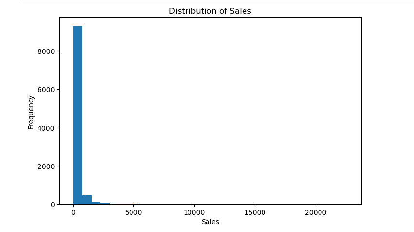

---

### Sales by Category
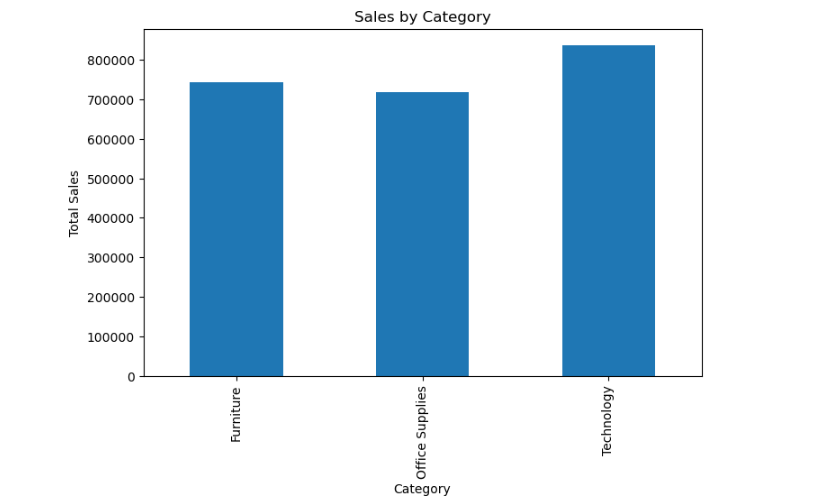

---

### Sales by Region
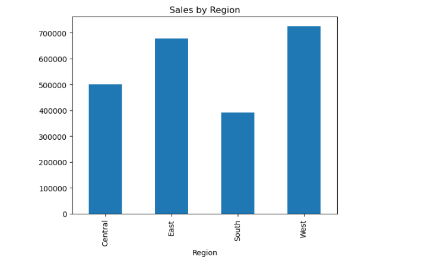

---

### Monthly Sales Trend
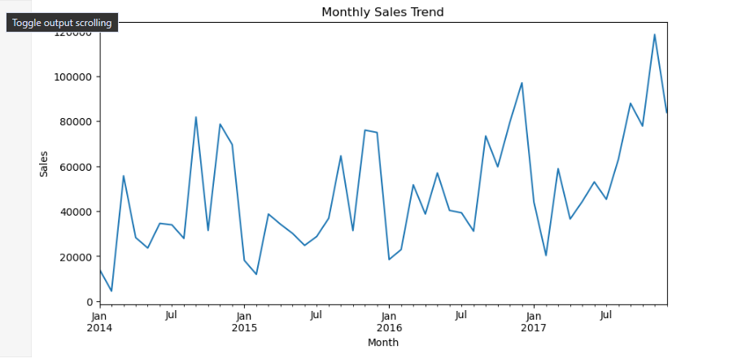

---

### Top Customers
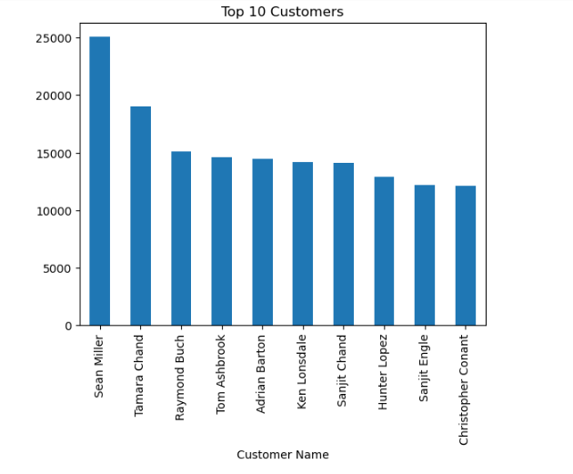

---

### Top Products
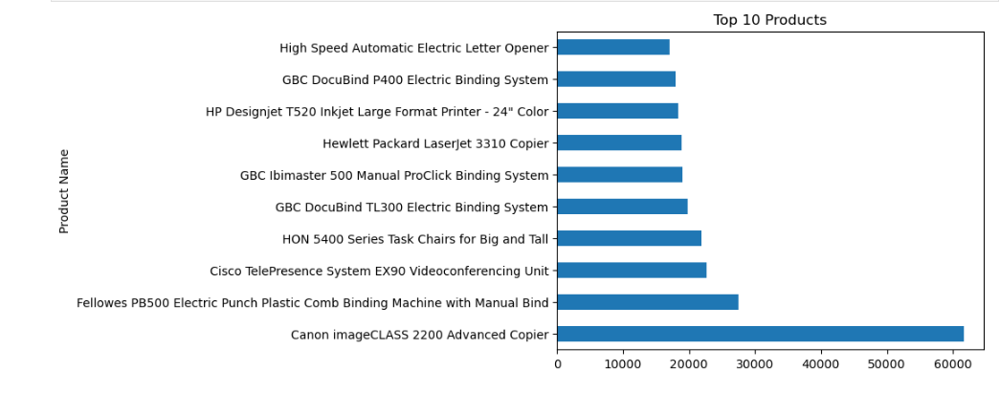

---

### Profit by Category
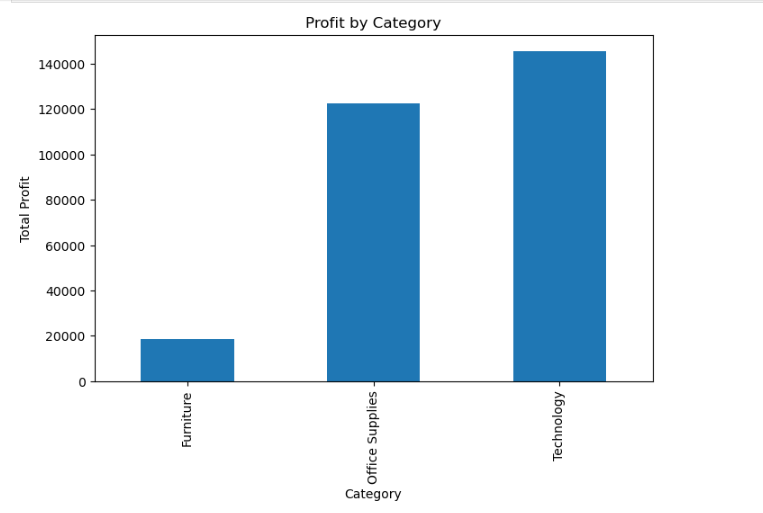

---

### Profit by Sub-Category
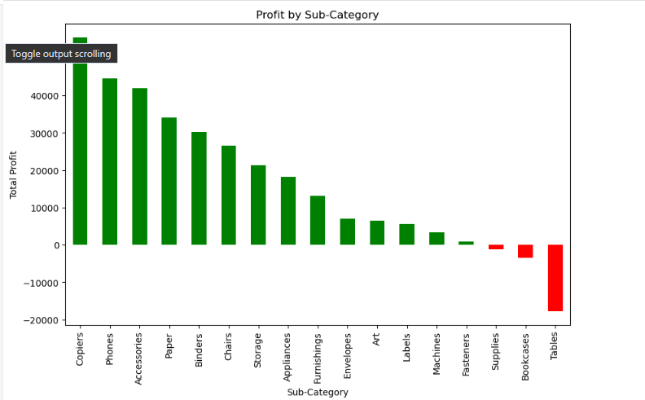

---

### Profit vs Sales
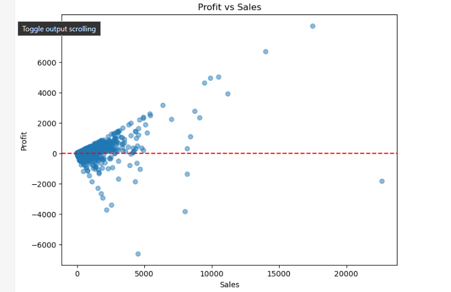

---

### Discount vs Profit
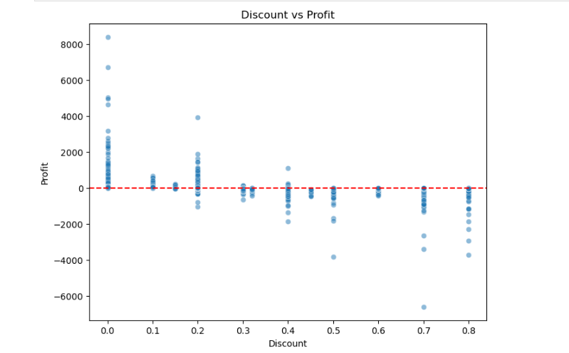

---

### Average Discount by Category
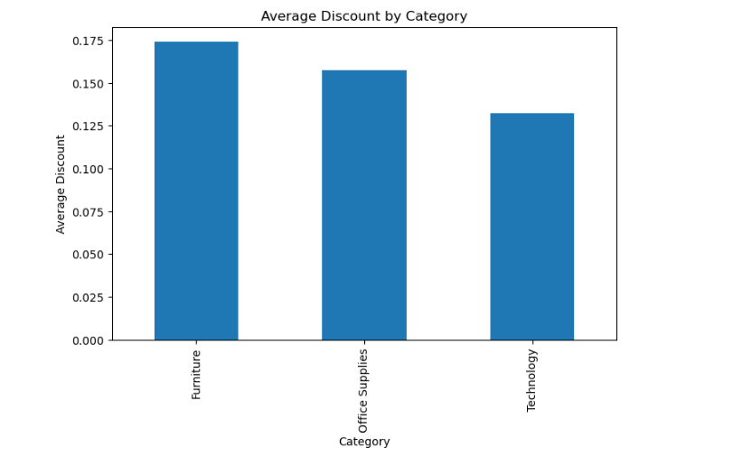

---

### Sales & Profit by Customer Segment
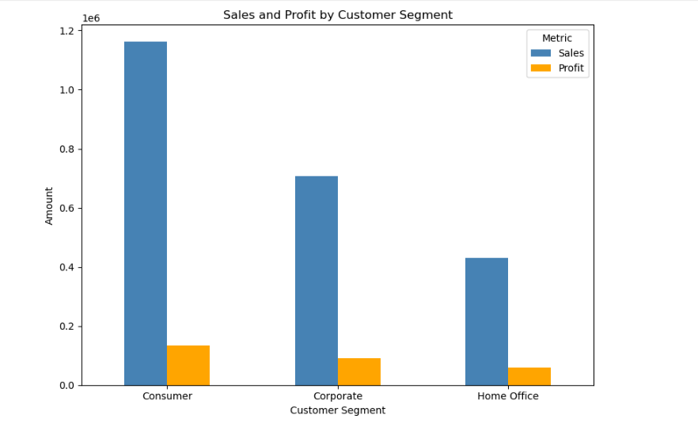

---

### Sales by Ship Mode
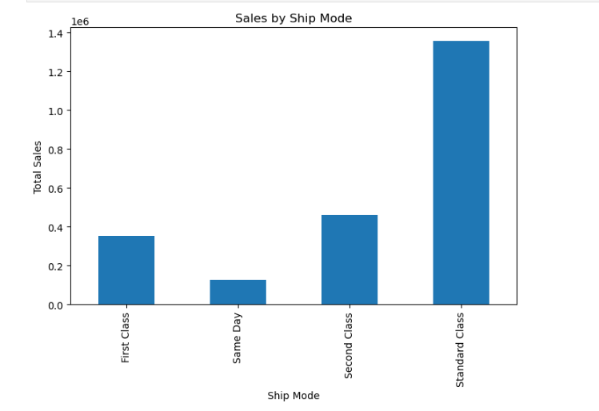

---

### Average Shipping Delay
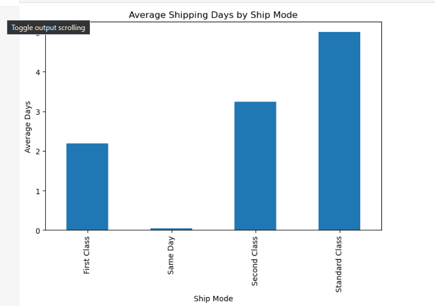

---

### Sales by Quarter
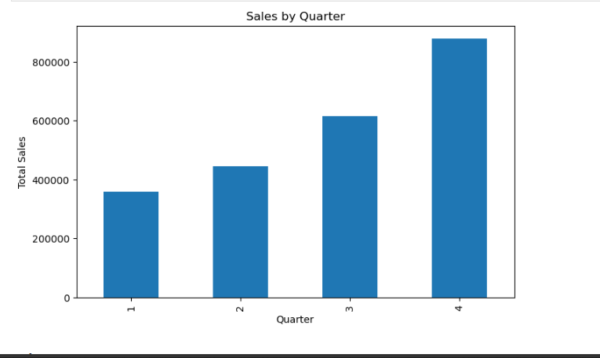

---

### Sales by Day of Week
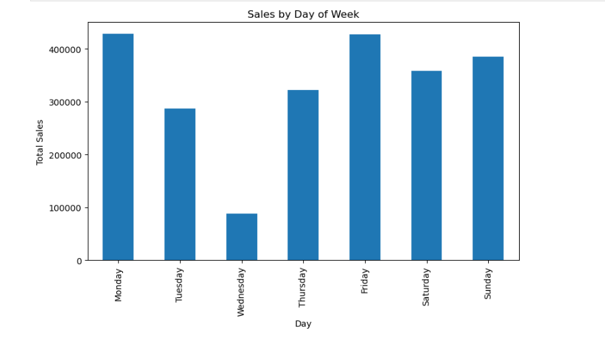

---

### Year-over-Year Sales
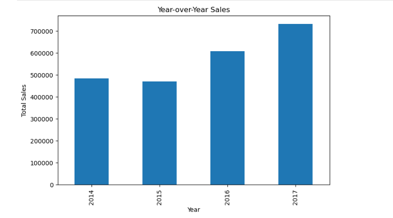

---

## 📦 Files Included

- `Exploratory_Data_Analysis.ipynb` – Complete EDA workflow, including data overview, visualizations, and business insights.
- `cleaned_data.csv` – Cleaned dataset used for analysis.
- `README.md` – Project documentation.
- `screenshots/` – Charts and visualizations used in the README.

---

## ▶️ How to Run

1. Clone this repository.
2. Install the required libraries:

```bash
pip install pandas matplotlib seaborn jupyter
```

3. Open `Exploratory_Data_Analysis.ipynb` in Jupyter Notebook.
4. Run all cells to reproduce the analysis and visualizations.

---

## 👨‍💻 Author

**Hudu Yusuf Ibrahim**

Aspiring Data Analyst passionate about transforming data into actionable business insights using **Python, SQL, Excel, Power BI, and Tableau**.

🔗 [Connect with me on LinkedIn](https://www.linkedin.com/in/hudu-yusuf-ibrahim-ba06b5365/)

⭐ If you found this project useful, consider giving it a star!
