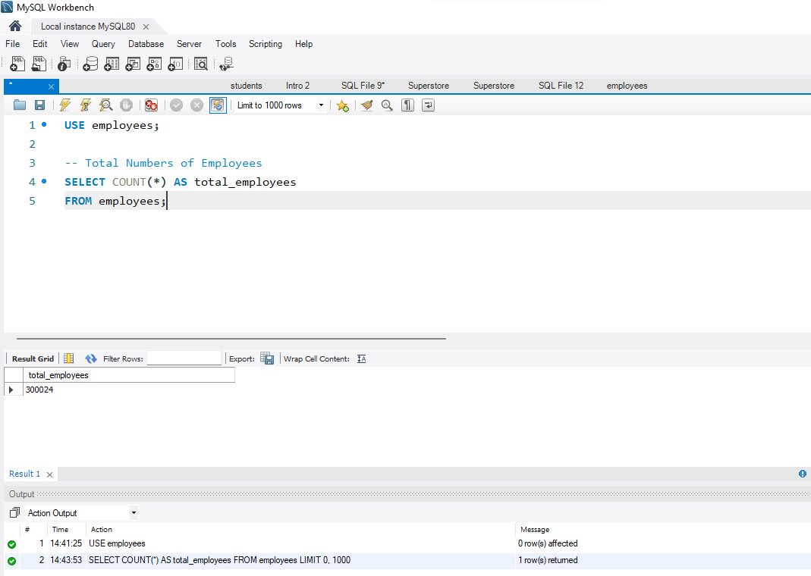
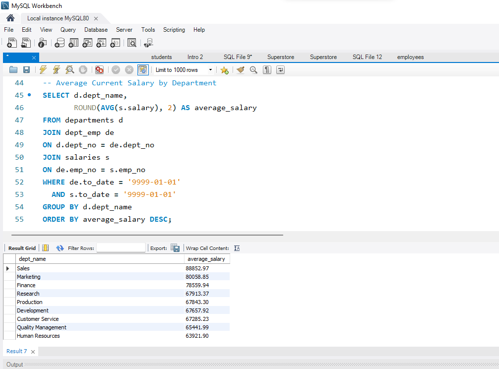
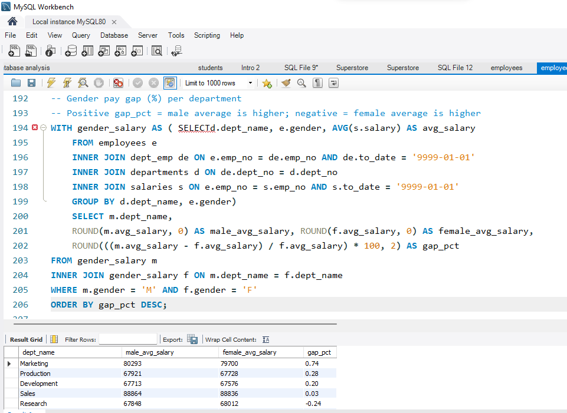

# Employee Database Analysis using SQL


## 📌 Project Overview

This project analyzes the **MySQL Employees Sample Database** to answer real-world Human Resources (HR) and workforce analytics questions using SQL.

The analysis explores employee demographics, department distribution, salary trends, managerial performance, employee tenure, promotions, salary growth, and gender pay differences. Through this project, I applied SQL to transform raw relational data into meaningful business insights.

---

## ⭐ Project Highlights

- Analyzed over **300,000 employee records**
- Answered **15+ HR business questions** using SQL
- Applied advanced SQL techniques including **CTEs**, **Window Functions**, and **Date Functions**
- Built a well-organized SQL project following industry-style repository practices
- Documented business questions, SQL queries, and analytical findings

---

## 📑 Table of Contents

- [Project Overview](#-project-overview)
- [Project Highlights](#-project-highlights)
- [Business Objectives](#-business-objectives)
- [Tools Used](#-tools-used)
- [Dataset](#-dataset)
- [Repository Structure](#-repository-structure)
- [SQL Concepts Demonstrated](#-sql-concepts-demonstrated)
- [Key Insights](#-key-insights)
- [How to Run](#-how-to-run)
- [Author](#-author)

---

## 🎯 Business Objectives

This project answers the following business questions:

- How many employees are in the company?
- What is the gender distribution across the workforce?
- How are employees distributed across departments?
- Who are the current department managers?
- Who are the highest-paid employees?
- What is the average salary in each department?
- Who are the top five highest-paid employees within each department?
- Which employees earn above their department's average salary?
- How long have employees worked at the company, and how does tenure vary across departments?
- Which employees experienced the highest salary growth?
- Who received the biggest single salary raise?
- How frequently are employees promoted?
- How large is each manager's team?
- Do managers earn more than the average salary in their departments?
- Is there a gender pay gap across departments?

---

## 🛠 Tools Used

- MySQL Server 8.0
- MySQL Workbench
- SQL (MySQL)

---

## 📁 Dataset

This project uses the **MySQL Employees Sample Database**, a publicly available dataset widely used for learning and practicing SQL.

The database contains over **300,000 employee records** across multiple related tables.

### Main Tables

- employees
- departments
- dept_emp
- dept_manager
- salaries
- titles

### Download Dataset

The dataset is maintained by **DataCharmer**.

Repository:

https://github.com/datacharmer/test_db

After downloading or cloning the repository, import the database using:

```bash
mysql -u root -p < employees.sql
```

---

## 📂 Repository Structure

```text
employee-database-analysis/
│
├── README.md
├── sql/
│   ├── 01_employee_overview.sql
│   ├── 02_department_analysis.sql
│   ├── 03_salary_analysis.sql
│   ├── 04_manager_analysis.sql
│   ├── 05_advanced_sql_analysis.sql
│   ├── 06_tenure_and_growth_analysis.sql
│   ├── 07_manager_performance_analysis.sql
│   └── 08_gender_pay_gap_analysis.sql
│
└── screenshots/
    ├── 01_total_employees.png
    ├── 02_gender_distribution.png
    ├── 03_employees_per_department.png
    ├── 04_current_department_managers.png
    ├── 05_top_10_highest_paid_employees.png
    ├── 06_average_salary_by_department.png
    ├── 07_top_5_highest_paid_each_department.png
    ├── 08_above_department_average_salary.png
    ├── 09_employee_tenure.png
    ├── 10_average_tenure_by_department.png
    ├── 11_salary_growth_analysis.png
    ├── 12_biggest_salary_raise.png
    ├── 13_promotion_analysis.png
    ├── 14_manager_team_size.png
    ├── 15_manager_salary_comparison.png
    ├── 16_average_salary_by_gender.png
    └── 17_gender_pay_gap.png
```

---

## 📊 SQL Concepts Demonstrated

- SELECT
- WHERE
- ORDER BY
- GROUP BY
- HAVING
- INNER JOIN
- Aggregate Functions (`COUNT`, `AVG`, `MAX`, `MIN`)
- Common Table Expressions (CTEs)
- Window Functions (`RANK`, `ROW_NUMBER`, `LAG`, `LEAD`)
- Date Functions (`TIMESTAMPDIFF`, `CURDATE`)
- String Functions (`CONCAT`)
- Mathematical Calculations
- Percentage Calculations
- Correlated Subqueries
- LIMIT

---

## 📈 Key Insights

- The database contains over **300,000 employees**.
- Workforce size differs across departments, reflecting varying operational needs.
- Current employee salaries vary considerably between departments.
- SQL window functions efficiently rank employees and analyze salary progression over time.
- Common Table Expressions (CTEs) simplify complex analytical queries.
- Employee tenure varies across departments.
- Salary growth differs significantly among employees throughout their careers.
- Managers supervise teams of different sizes depending on department.
- Manager salaries can be compared with department averages to evaluate compensation positioning.
- The analysis identifies differences in average salaries between genders across departments. These findings are descriptive and can support further pay equity investigations but do not, by themselves, establish the presence or cause of pay discrimination.

---

## 🚀 How to Run

1. Install **MySQL Server** and **MySQL Workbench**.
2. Download and import the **MySQL Employees Sample Database**.
3. Open the SQL files in the **sql** folder.
4. Execute each SQL script in MySQL Workbench.
5. Review the screenshots to compare the query outputs and analyses.

---
## 📸 Sample Outputs

### Total Employees



### Average Salary by Department



### Gender Pay Gap Analysis


---
## 👤 Author

**Hudu Yusuf Ibrahim**

Aspiring Data Analyst with hands-on experience building business-focused analytics projects using **Excel, SQL, Python, Power BI, and Tableau**. Passionate about transforming raw data into actionable insights through data cleaning, analysis, and visualization.

- **GitHub:** https://github.com/01Yusufh
- **LinkedIn:** https://www.linkedin.com/in/hudu-yusuf-ibrahim-ba06b5365/
