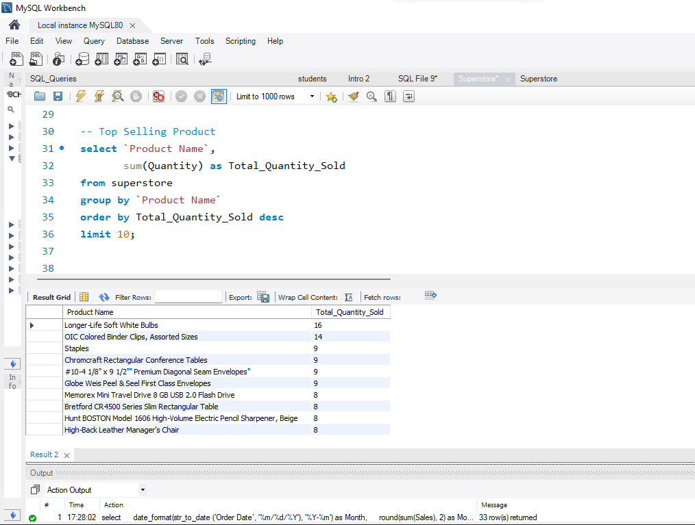
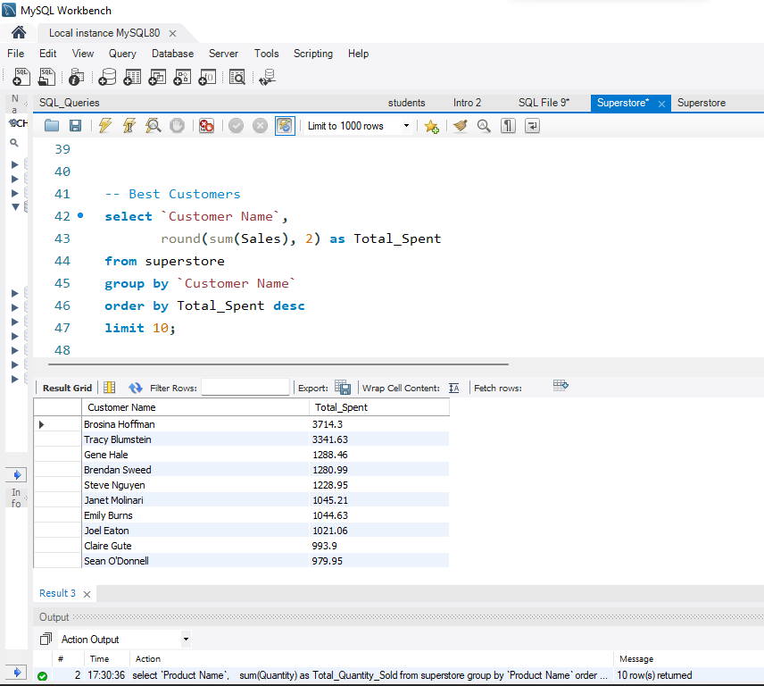
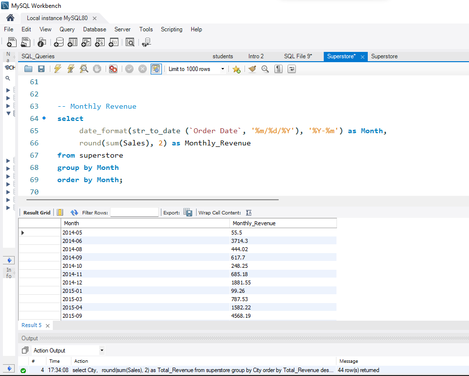
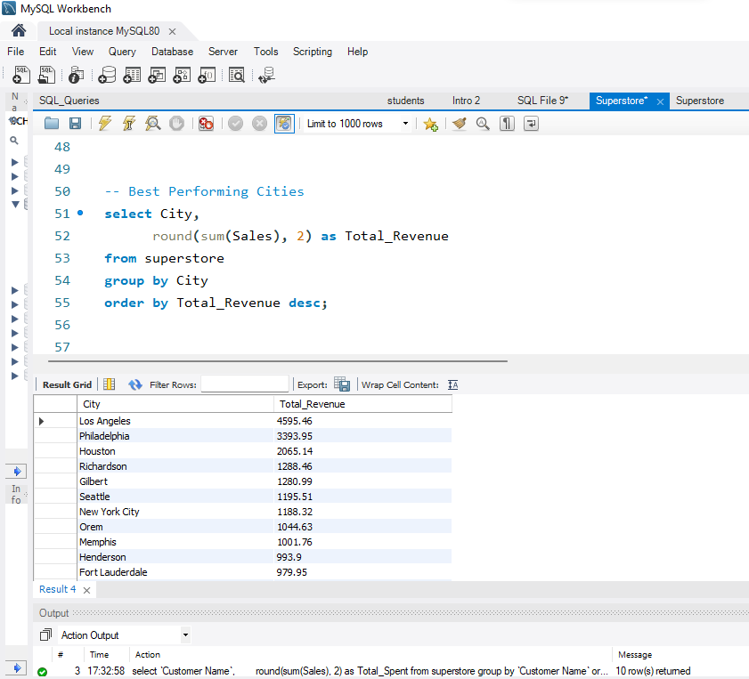

# 🛒 Retail Sales Analysis Using SQL

## 📌 Project Overview

This project analyzes retail sales data using MySQL to uncover business insights from customer transactions. The objective was to answer key business questions related to product performance, customer spending, monthly revenue trends, and city-level sales performance.

The project demonstrates practical SQL skills commonly used by data analysts, including data aggregation, sorting, grouping, date manipulation, and business reporting.

---

## 🎯 Business Questions

- Which products sold the highest quantity?
- Who are the top spending customers?
- How does revenue change over time?
- Which cities generate the highest revenue?

---

## 🛠️ Tools Used

- MySQL Workbench 8.0
- SQL
- Superstore Sales Dataset

---

## 📂 Dataset

The dataset contains retail sales transactions with the following fields:

- Order ID
- Order Date
- Customer Name
- City
- Category
- Product Name
- Quantity
- Sales
- Profit

---

## 🧠 SQL Skills Demonstrated

- SELECT
- GROUP BY
- ORDER BY
- Aggregate Functions (SUM, ROUND)
- Date Functions (`STR_TO_DATE`, `DATE_FORMAT`)
- Data Aggregation

---

## 📊 Business Analysis

### 1. Top Selling Products

Identified the products with the highest quantities sold.

**Key Finding**

- **Longer-Life Soft White Bulbs** was the best-selling product with **16 units sold**.
- Office supplies dominated the top-selling product list, indicating consistent customer demand for everyday office essentials.

---

### 2. Best Customers

Calculated total spending for each customer.

**Key Finding**

- **Brosina Hoffman** was the highest-value customer with **$3,714.30** in total purchases.
- The top customers contributed significantly more revenue than the average customer, highlighting the importance of customer retention strategies.

---

### 3. Monthly Revenue Analysis

Converted text dates into proper date format and analyzed monthly sales performance.

**Key Finding**

- Revenue fluctuated across different months.
- **September 2015** recorded one of the strongest sales months with approximately **$4,568.19** in revenue, indicating seasonal demand patterns.

---

### 4. Best Performing Cities

Compared total sales across cities.

**Key Finding**

- **Los Angeles** generated the highest revenue (**$4,595.46**), followed by **Philadelphia** (**$3,393.95**) and **Houston** (**$2,065.14**).
- These cities represent the strongest-performing markets and could be prioritized for future sales and marketing efforts.

---

## 📈 Key Insights

- Los Angeles generated the highest total revenue ($4,594.64), in making in best performing city in the dataset. 
- Brosina Hoffman was  the highest spending customer, with total purchase of $3,714.30.
- Longer-Life Soft White Bulbs was the top-selling product by quantity, with 16 unit sold.
- Monthly revenue fluctuated through out the analysis period, with September 2015 recording one of the highest monthly revenue ($4,568.19), suggesting possible seasonal variationin sales.

---

## 📷 Project Screenshots

### Top Selling Products

### Best Customers
 

### Monthly Revenue

### Best Performing Cities

---

## 🎓 Learning Outcomes

Through this project, I learned how to:

- Import CSV data into MySQL.
- Write SQL queries to solve real business problems.
- Summarize data using aggregate functions.
- Analyze sales trends across customers, products, cities, and time.
- Convert raw query outputs into actionable business insights.

---

## 👤 Author

**Hudu Yusuf Ibrahim**

Aspiring Data Analyst passionate about transforming raw data into meaningful business insights using SQL, Excel, Python, Power BI, and Tableau.

- **GitHub:** https://github.com/01Yusufh
- **LinkedIn:** https://www.linkedin.com/in/hudu-yusuf-ibrahim-ba06b5365
