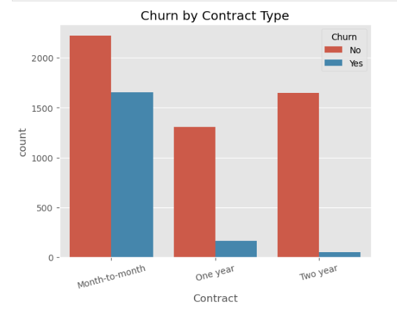
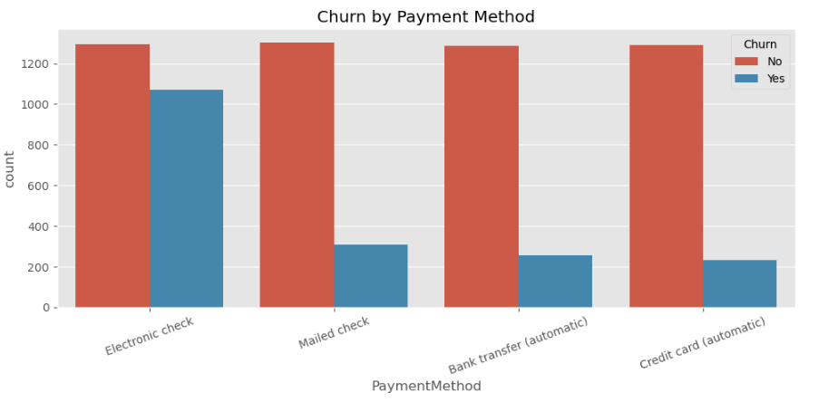
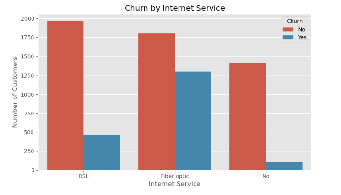
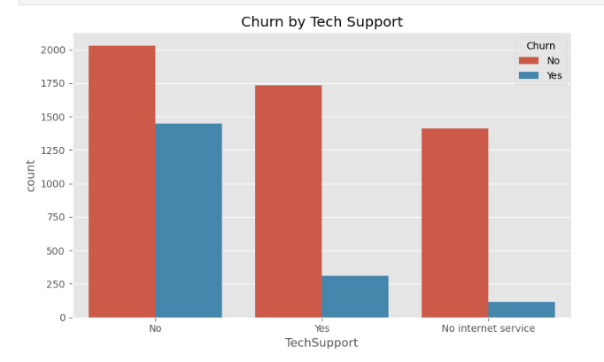
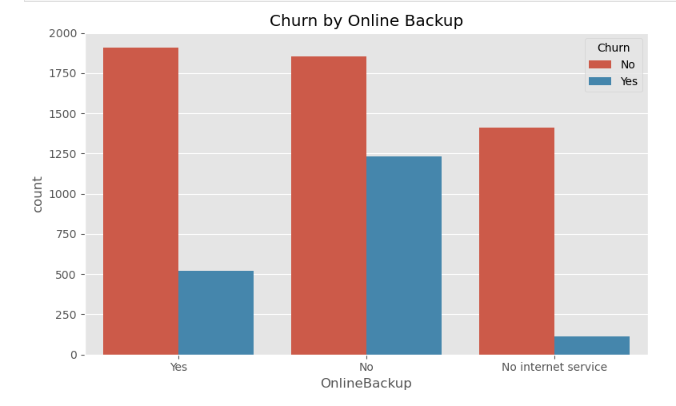
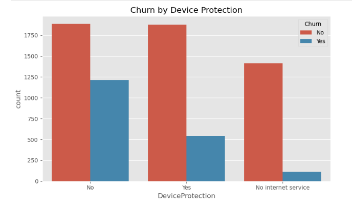
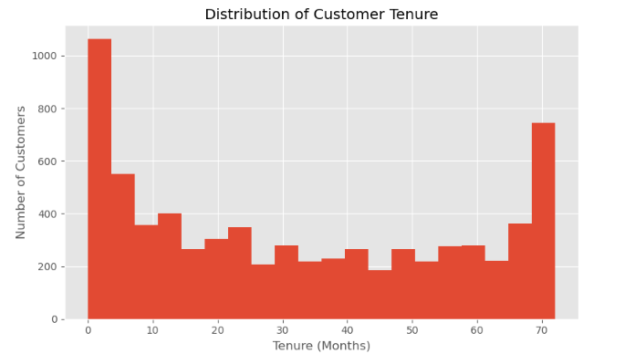
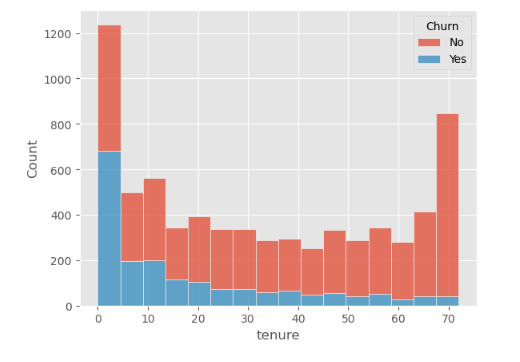

## 💡 Key Findings

### 1. Contract Type

Month-to-Month customers recorded the highest churn rate at **42.7%**, compared with **11.3%** for One-Year contracts and **2.8%** for Two-Year contracts.

This indicates a strong association between contract duration and customer retention.



---

### 2. Payment Method

Customers using **Electronic Check** recorded the highest churn rate among payment methods at **45.3%**.

Other payment methods had considerably lower churn rates:

- Bank transfer (automatic): **16.7%**
- Credit card (automatic): **15.2%**
- Mailed check: **19.1%**



---

### 3. Internet Service

**Fiber Optic** customers recorded the highest churn rate among internet service categories at **41.9%**.

For comparison:

- DSL: **19.0%**
- No internet service: **7.4%**

This identifies Fiber Optic customers as an important segment for further investigation.



---

### 4. Value-Added Services

Customers without value-added services consistently recorded higher churn rates than customers who subscribed to them.

| Service | Without Service | With Service |
|---|---:|---:|
| Online Security | **41.8%** | **14.6%** |
| Tech Support | **41.6%** | **15.2%** |
| Online Backup | **39.9%** | **21.5%** |
| Device Protection | **39.1%** | **22.5%** |








These results show a consistent association between subscription to value-added services and lower churn.

The analysis does not establish that these services directly cause customers to stay.

---

### 5. Customer Tenure

**30.9% of customers have been with the company for less than 12 months**, making early-tenure customers an important segment for retention analysis.

Churn was more concentrated among customers with shorter tenures, while longer-tenured customers were more likely to remain with the company.





---

## 📁 Project Structure

```text
customer-churn-analysis/
│
├── README.md
│
├── dataset/
│   └── telco_customer_churn.csv
│
├── notebook/
│   └── customer_churn_analysis.ipynb
│
├── reports/
│   ├── business_understanding_report.pdf
│   └── dataset_inspection_report.pdf
│
├── presentation/
│   └── customer_churn_analysis.pptx
│
└── screenshots/
    └── churn-by-contract.png

---

## 👨‍💻 Author

**Hudu Yusuf Ibrahim**

**Data Analyst Intern | AnalystLab Africa**

Aspiring Data Analyst with experience in Python, SQL, Excel, Power BI, and Tableau, focused on transforming data into actionable business insights.

### 🔗 Connect With Me

- **GitHub:** [github.com/01Yusufh](https://github.com/01Yusufh)
- **LinkedIn:** [linkedin.com/in/hudu-yusuf-ibrahim-ba06b5365](https://www.linkedin.com/in/hudu-yusuf-ibrahim-ba06b5365)