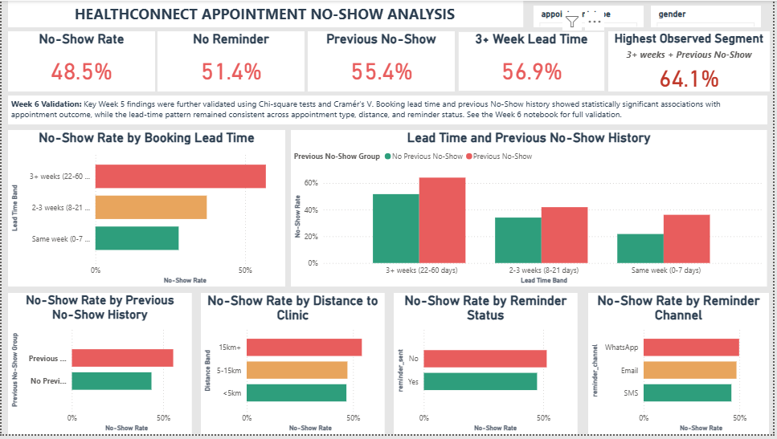

# HealthConnect — Week 6: Advanced Analytics & Decision Support

**Program:** AnalystLab Africa — HealthConnect Experience Lab  
**Track:** Data Analytics    
**Prepared by:** Hudu Yusuf Ibrahim

---

## 📌 Project Overview

Week 6 focused on advancing the HealthConnect appointment No-Show analysis completed in Week 5.

The analysis moved beyond descriptive exploratory analysis by applying statistical validation, deeper segmentation, KPI refinement, dashboard improvement, and cross-track integration with the Data Science track.

The main focus was to validate whether the Week 5 findings around **booking lead time** and **previous No-Show history** remained consistent across different appointment characteristics and whether they were supported by statistical and predictive modelling evidence.

---

## 🎯 Week 6 Objectives

The main objectives were to:

- Validate key Week 5 findings using statistical testing.
- Measure the strength of observed associations using Cramér's V.
- Investigate important segments across appointment characteristics.
- Refine and prioritise KPIs based on Week 6 evidence.
- Improve the Power BI dashboard.
- Integrate findings with the Data Science track.
- Compare descriptive analytical findings with predictive modelling results.
- Translate validated findings into evidence-based business recommendations.
- Document limitations and requirements for future modelling and testing.

---

## 🛠️ Tools & Technologies

- **Python**
- **Pandas**
- **NumPy**
- **SciPy**
- **Matplotlib**
- **Jupyter Notebook**
- **Power BI**
- **DAX**
- **Chi-square Test**
- **Cramér's V**
- **Logistic Regression**
- **Random Forest**

---

## 📊 Statistical Validation

Two major Week 5 findings were statistically validated:

| Factor | Chi-square | p-value | Cramér's V | Interpretation |
|---|---:|---:|---:|---|
| Booking Lead Time | 280.09 | < 0.0001 | 0.167 | Statistically significant association with appointment outcome |
| Previous No-Show History | 69.86 | < 0.0001 | 0.118 | Statistically significant association with appointment outcome |
| Combined Lead Time × Previous No-Show | 358.52 | < 0.0001 | 0.189 | Strongest observed association among the tested factors |

The results indicate that booking lead time and previous No-Show history are associated with appointment outcomes.

However, the effect sizes were modest, and statistical significance does not establish causation or guarantee predictive performance.

---

## 🔍 Key Findings

### 1. Booking Lead Time

Booking lead time remained the strongest individual analytical finding.

The observed No-Show rate increased from:

- **27.8%** for same-week bookings
- **37.2%** for 2–3 week bookings
- **56.9%** for bookings made 3+ weeks in advance

The pattern remained visible across appointment types, distance groups, and reminder-status groups.

---

### 2. Previous No-Show History

Patients with previous No-Show history had a higher observed No-Show rate:

- **43.5%** — No previous No-Show
- **55.4%** — Previous No-Show

This pattern was also observed across the different appointment types.

---

### 3. Combined Lead Time × Previous No-Show

Combining booking lead time and previous No-Show history revealed a stronger segmentation pattern.

The observed No-Show rate ranged from:

- **21.8%** — Same week + No previous No-Show
- **64.1%** — 3+ weeks + Previous No-Show

The combined six-category analysis produced the highest Cramér's V among the tested factors (**0.189**).

This segment was therefore elevated as a priority area for further investigation and predictive modelling.

---

### 4. Distance to Clinic

Distance showed an observed relationship with No-Show rate, with the highest distance group having the highest observed rate.

However, the Data Science ablation analysis found that removing distance slightly improved model AUC in the reported modelling setup.

Therefore, distance was retained as a supporting analytical finding rather than prioritised as an independent modelling feature.

---

### 5. Reminder Analysis

Reminder status and reminder channel showed smaller differences compared with booking lead time and previous No-Show history.

The analysis therefore treats reminders as a supporting factor rather than a standalone explanation of No-Show behaviour.

---

## 🤝 Cross-Track Integration — Data Science

Week 6 included actual cross-track collaboration with members of the **Data Science track**, including **Donald Nwachukwu** and **Fatimah**.

The Data Analytics track provided:

- Booking lead-time findings
- Previous No-Show analysis
- Combined Lead Time × Previous No-Show segmentation
- Statistical validation results
- KPI refinement
- Business insights for predictive validation

The Data Science track provided:

- Logistic Regression results
- Random Forest results
- Model performance metrics
- Feature importance and coefficients
- Feature significance results
- Ablation analysis
- Model error-analysis findings

### Predictive Modelling Validation

Across the reported modelling evaluations, Logistic Regression achieved ROC-AUC values of approximately **0.67–0.68**, outperforming Random Forest in those evaluations.

The Data Science analysis also supported the importance of:

- `booking_lead_days`
- `previous_no_shows`
- `prior_no_show_rate`
- `previous_appointments`

The ablation analysis further showed that:

- `booking_lead_days` was more informative than `lead_time_bucket`.
- `is_new_patient` added little information beyond `previous_appointments`.
- `previous_no_shows` and `prior_no_show_rate` both contributed useful information.
- `reminder_sent` overlapped with `reminder_channel`.
- `distance_to_clinic_km` provided limited additional predictive value in the reported model setup.

---

## 💡 Unexpected Data Science Finding

The Data Science error analysis identified an unexpected pattern.

Among the No-Show cases examined by the model, **false negatives** — No-Shows the model failed to identify — were more likely to have received reminders than the No-Shows the model correctly identified.

Reported comparison:

- **Reminder received:** 80% of false negatives vs 67% of correctly identified No-Shows
- **SMS reminder:** 50% of false negatives vs 32% of correctly identified No-Shows

This suggests that reminder status alone may not be sufficient to identify all No-Show cases.

The finding should be investigated further during future predictive modelling and validation.

---

## 📌 Segment Rate Methodology Note

A methodological difference was identified between the Data Analytics and Data Science calculations for the highest-risk segment.

- **Data Analytics:** 64.1%
- **Data Science:** 70.5%

The difference was attributed to a different denominator definition. The Data Analytics calculation included all appointment outcomes, including Cancelled appointments, while the Data Science calculation excluded Cancelled appointments.

This highlighted the importance of clearly defining the denominator when calculating and comparing No-Show rates.

Despite the difference in percentages, both analyses identified the same overall pattern: **long booking lead times combined with previous No-Show history were associated with the highest observed No-Show rates.**

---

## 📈 KPI & Dashboard Refinement

The Week 5 dashboard was refined based on the Week 6 analysis.

### Core priorities

- Overall No-Show Rate
- No-Show Rate by Booking Lead Time
- No-Show Rate by Previous No-Show History
- Combined Lead Time × Previous No-Show segment

### Supporting analysis

- Distance to Clinic
- Reminder Status
- Reminder Channel

### Dashboard filters

- Appointment Type
- Gender

### Dashboard Preview

The dashboard was designed to communicate the validated findings while allowing interactive exploration of appointment characteristics.

---

## 💼 Business Recommendations

Based on the Week 6 findings:

1. **Monitor long booking lead times** and investigate operational approaches for appointments scheduled far in advance.

2. **Prioritise the 3+ weeks + Previous No-Show segment** for further investigation and potential targeted confirmation or outreach strategies.

3. **Continue using reminders as a supporting intervention**, but do not treat reminder status alone as a sufficient indicator of No-Show risk.

4. **Consider distance-related support** for patients travelling longer distances, while recognising that distance showed limited additional predictive value in the reported model setup.

5. **Prioritise booking lead time and previous No-Show history for future predictive modelling**, as both were supported by the Data Analytics validation and Data Science modelling results.

These recommendations should be treated as hypotheses for further testing rather than proven causal solutions.

---

## ⚠️ Limitations

- The HealthConnect dataset is synthetic and should not be treated as real-world clinic data.
- Statistical association does not establish causation.
- The tested associations had modest effect sizes.
- Data Analytics did not build or evaluate a predictive model independently.
- Some segmented groups had relatively small sample sizes.
- The combined segment analysis does not establish a causal interaction.
- Reminder analysis does not establish reminder effectiveness.
- Historical variables such as `previous_appointments` and `previous_no_shows` are synthetic.
- Missing values exist in several fields, including `reminder_channel`, `distance_to_clinic_km`, and `waiting_time_minutes`.
- The "Prefer not to say" gender group is relatively small.
- The findings should be validated against real-world operational data before implementation.

---
## 📁 Deliverables

This Week 6 submission includes:

- **track_specific_output:** Week 6 Advanced Analytics & Decision Support Notebook covering data validation, statistical testing, KPI refinement, business insights, recommendations, and limitations
- **report:** week_6_project_summary (documenting planned work, completed analysis, key findings, KPI refinement, challenges, decisions, cross-track collaboration attempt, and Week 7 focus) and cross-track_integration_evidence (Evidence of your Week 6 collaboration/integration activity).
- **supporting_files:** `health_connect_no_show_analysis.pbix` — refined Power BI dashboard
- **screenshots:** Power BI dashboard screenshots showing the refined Week 6 analysis and validation
- **README.md**
---

## 👤 Author

**Hudu Yusuf Ibrahim**

### Connect With Me

🔗 **GitHub:**  
https://github.com/01Yusufh

🔗 **LinkedIn:**  
https://www.linkedin.com/in/hudu-yusuf-ibrahim-ba06b5365
