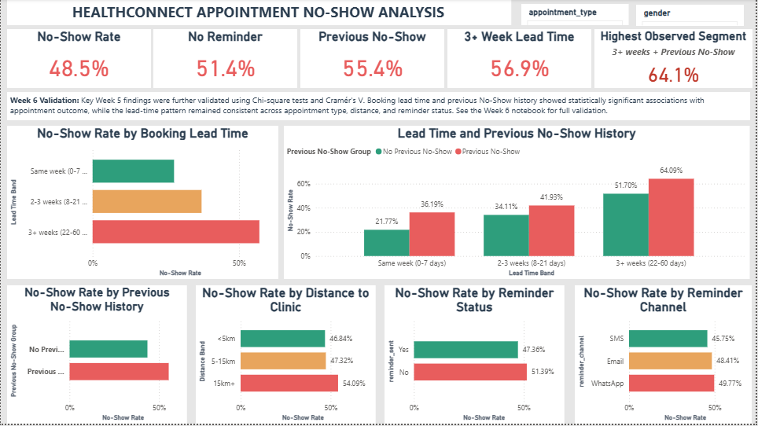
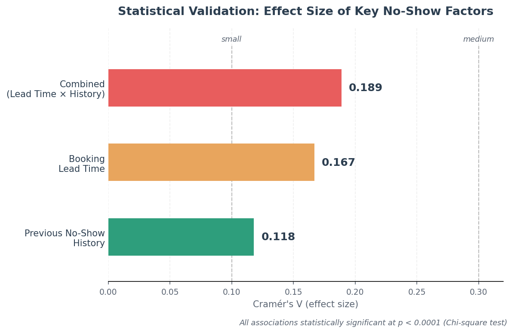
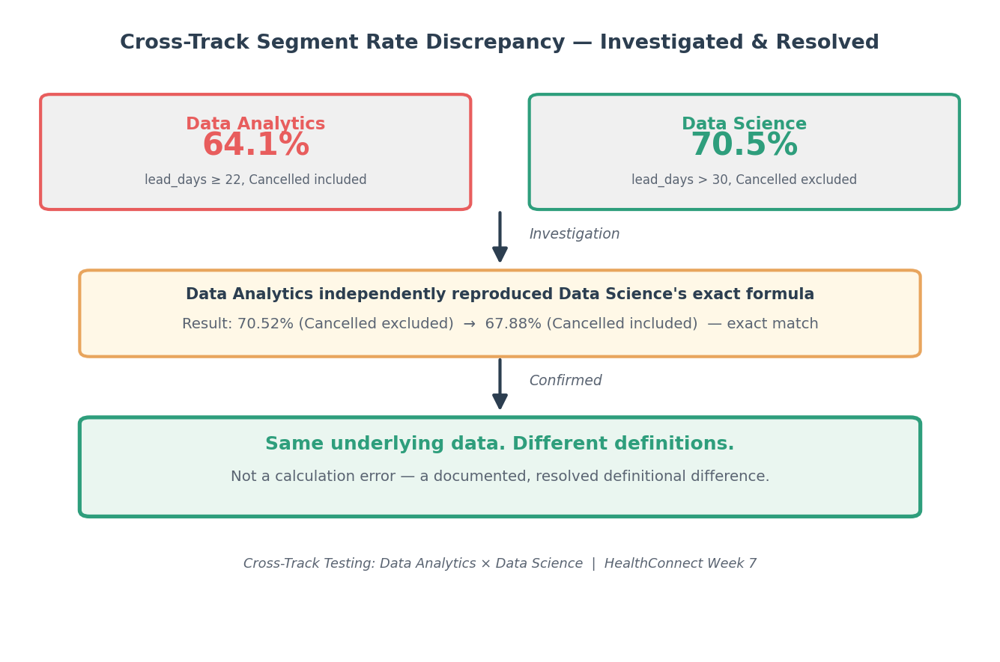

# HealthConnect — Week 7: Testing, Refinement & Validation

**HealthConnect Experience Lab — Data Analytics Track**

**Prepared by:** Hudu Yusuf Ibrahim 

---

## 📌 Project Overview

Week 7 focused on testing, refinement, and end-to-end validation of the HealthConnect Data Analytics work developed during Week 6.

The goal was not to repeat the previous analysis, but to systematically test the existing analytical outputs, Power BI dashboard, KPI calculations, filters, segment definitions, and cross-track dependencies.

Where issues were identified, they were corrected and retested. Where no issue was found, the successful validation was documented.

---

## 🎯 Objectives

The main objectives of Week 7 were to:

- Validate important KPI calculations.
- Compare Power BI dashboard values with independent Python calculations.
- Test dashboard visuals and filters.
- Validate the Lead Time × Previous No-Show segmentation.
- Identify genuine analytical or dashboard issues.
- Refine the dashboard where required.
- Retest the dashboard after refinement.
- Complete meaningful cross-track testing with Data Science.
- Document validated findings, limitations, and remaining dependencies.
- Prepare the project for Week 8 development.

---

## 🧪 Testing & Validation

The following dashboard components were tested:

- 5 KPI cards
- 6 comparison visuals
- Appointment Type slicer
- Gender slicer
- Lead Time × Previous No-Show visual
- Lead Time Band ordering
- Dashboard calculations against independent Python calculations

The main KPI and visual calculations matched the independent calculations.

### Validated KPIs

| KPI | Result |
|---|---:|
| Overall No-Show Rate | 48.5% |
| No Reminder | 51.4% |
| Previous No-Show | 55.4% |
| 3+ Week Lead Time | 56.9% |
| Highest Observed Segment | 64.1% |

**Overall KPI validation: PASS**

---

## 🔧 Dashboard Refinement

Week 7 testing identified a Lead Time Band ordering issue in the Power BI dashboard.

The intended order was:

1. Same week (0–7 days)
2. 2–3 weeks (8–21 days)
3. 3+ weeks (22–60 days)

A separate `Lead Time Band Sort` column was created directly from `booking_lead_days` and applied using Sort by Column.

The affected dashboard components were then retested.

### Retest Result

- KPI cards: **PASS**
- Comparison visuals: **PASS**
- Appointment Type slicer: **PASS**
- Gender slicer: **PASS**
- Combined analysis: **PASS**
- Lead Time Band ordering: **PASS**

No new calculation or filtering issues were identified after the refinement.

---

## 🤝 HC-POD Cross-Track Testing

A meaningful cross-track testing activity was completed with the **Data Science Track — Donald Nwachukwu**.

The component tested was the Lead Time × Previous No-Show segment calculation.

The Data Science segment was defined as:

```
booking_lead_days > 30
AND
previous_no_shows >= 1
```

The Data Analytics track independently reproduced the calculation using the HealthConnect dataset.

### Validation Results

| Definition | No-Show Rate |
|---|---:|
| Cancelled excluded | 70.52% |
| Cancelled included | 67.88% |

The independent calculation reproduced the Data Science results exactly.

**Finding:** The testing identified differences between the original Data Analytics and Data Science definitions — Data Analytics used `booking_lead_days ≥ 22`, while Data Science used `booking_lead_days > 30`. There was also a difference in the treatment of Cancelled appointments in the denominator.

The criteria and denominator rules were therefore explicitly documented for future cross-track comparisons.

**Cross-track testing result: PASS**

---

## 📊 Key Validated Findings

### Booking Lead Time

| Lead Time | No-Show Rate |
|---|---:|
| Same week | 27.8% |
| 2–3 weeks | 37.2% |
| 3+ weeks | 56.9% |

### Previous No-Show History

| Previous No-Show History | No-Show Rate |
|---|---:|
| No previous No-Show | 43.5% |
| Previous No-Show | 55.4% |

### Combined Lead Time × Previous No-Show

| Lead Time | No Previous No-Show | Previous No-Show |
|---|---:|---:|
| Same week | 21.8% | 36.2% |
| 2–3 weeks | 34.1% | 41.9% |
| 3+ weeks | 51.7% | 64.1% |

The combined six-category analysis had a Cramér's V of **0.189** in Week 6 — the strongest observed association among the tested segmentation approaches.

These findings describe observed relationships and should not be interpreted as proof of causation.

---

## 💡 Updated Business Recommendations

Based on the validated results:

1. Give additional attention to appointments with longer booking lead times.
2. Use previous No-Show history as a practical segmentation factor.
3. Consider combining lead time and previous No-Show history when prioritising appointments for monitoring.
4. Continue monitoring reminder activity without assuming causal effectiveness.
5. Treat distance as a supporting factor rather than a primary predictive factor.
6. Use the validated Power BI dashboard for ongoing monitoring.
7. Maintain consistent segment definitions and denominator rules across HealthConnect tracks.

---

## ⚠️ Limitations

The Week 7 validation does not remove the limitations of the underlying analysis. Key limitations include:

- The HealthConnect dataset is synthetic.
- Previous appointment history may not represent complete real-world patient histories.
- Some variables contain missing values.
- The analysis is observational and does not establish causation.
- Some subgroups have relatively small sample sizes.
- Statistical association does not automatically demonstrate predictive performance.
- Different segment definitions can produce different No-Show Rates.
- Dashboard outputs should be revalidated after substantial changes to the data, DAX measures, or analytical definitions.

---

## 📸 Project Evidence

Only the most important visual evidence is included below to keep the README concise and recruiter-friendly.

### 1. Final Power BI Dashboard



The final dashboard presents the validated No-Show KPIs, booking lead-time patterns, previous No-Show history, reminder activity, distance analysis, and combined segmentation.

### 2. Statistical Validation — Effect Size Comparison



Booking lead time, previous No-Show history, and their combination were each statistically validated using Chi-square tests and Cramér's V. The combined factor showed the strongest effect size (0.189) of any relationship tested, confirming that the two variables carry more signal together than either does alone.

### 3. Cross-Track Validation — Data Science



A reported discrepancy between the Data Analytics (64.1%) and Data Science (70.5%) segment rates was investigated through cross-track testing. Independently reproducing the Data Science calculation confirmed the reported Data Science figures under its stated definition. The testing identified differences in the lead-time thresholds and denominator rules used by the two analyses.

---

## 📁 Project Structure

```text
week-7-testing-refinement-validation/
│
├── notebook/
│   └── HealthConnect_Week_7_Testing_Refinement.ipynb
│
├── report/
│   ├── HealthConnect_Week_7_Project_Summary.pdf
│   ├── Testing_Refinement_Validation_Record.pdf
│   └── HC-POD_Cross-Track_Evidence.pdf
│
├── screenshots/
│   ├── 01_final_dashboard.png
│   ├── 02_effect_size_validation.png
│   └── 03_cross_track_validation.png
│
├── supporting-files/
│   └── HealthConnect_Week_7_Dashboard.pbix
│
└── README.md
```

---

## 📂 Deliverables

### Notebook

The Week 7 notebook contains:

- Week 6 → Week 7 transition
- Testing readiness
- KPI validation
- Analytical validation
- Segment testing
- Power BI dashboard testing
- Issues identified
- Dashboard refinement
- Retesting
- Cross-track testing
- Validated findings
- Updated business insights
- Updated recommendations
- Limitations
- Remaining analytical issues
- Week 8 recommendations

### Reports

The `report/` folder contains:

- Week 7 Project Summary
- Testing, Refinement & Validation Record
- HC-POD Cross-Track Evidence

### Supporting File

The `supporting-files/` folder contains the Power BI dashboard used for the Week 7 testing and validation.

---

## 👤 My Contribution

As a Data Analytics intern, I contributed to the HealthConnect project by:

- Independently validating the main Power BI KPIs.
- Testing six dashboard comparison visuals.
- Testing dashboard slicers.
- Validating the combined Lead Time × Previous No-Show analysis.
- Identifying and correcting the Lead Time Band sorting issue.
- Retesting the dashboard after refinement.
- Conducting meaningful cross-track testing with Data Science.
- Independently reproducing the Data Science segment calculation.
- Documenting differences in analytical definitions.
- Refining business insights and recommendations.
- Preparing validated analytical outputs for continued HealthConnect development.

---

## 🚀 Week 8 Direction

Week 8 will build on the validated Week 7 outputs rather than restarting the analysis.

The main priorities are to:

1. Carry forward the validated Lead Time × Previous No-Show findings.
2. Maintain consistent analytical definitions across HealthConnect tracks.
3. Continue cross-track integration where analytical outputs become dependencies.
4. Further evaluate the predictive usefulness of the combined segmentation.
5. Reassess findings when more representative operational data becomes available.
6. Use the validated Week 7 dashboard as the baseline for future development.

---

## 🔗 Connect With Me

**GitHub:** https://github.com/01Yusufh
**LinkedIn:** https://www.linkedin.com/in/hudu-yusuf-ibrahim-ba06b5365

---

## 📌 Final Summary

Week 7 moved the HealthConnect Data Analytics work from integration into systematic testing, refinement, and validation.

The main dashboard calculations and analytical findings were independently validated, the Lead Time Band sorting issue was corrected and successfully retested, and the Data Science segment calculation was independently reproduced through cross-track testing.

The result is a tested, refined, and clearly documented analytical baseline ready for continued HealthConnect development in Week 8.
