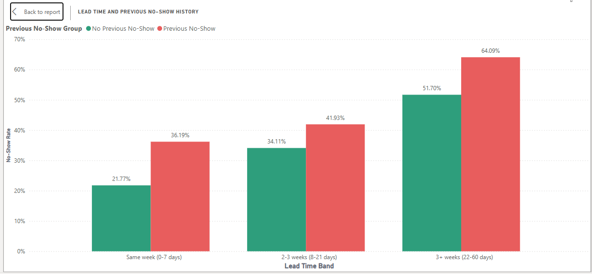
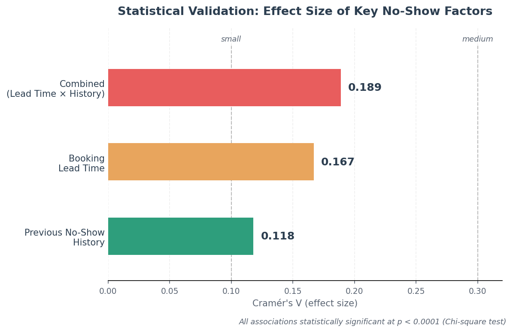
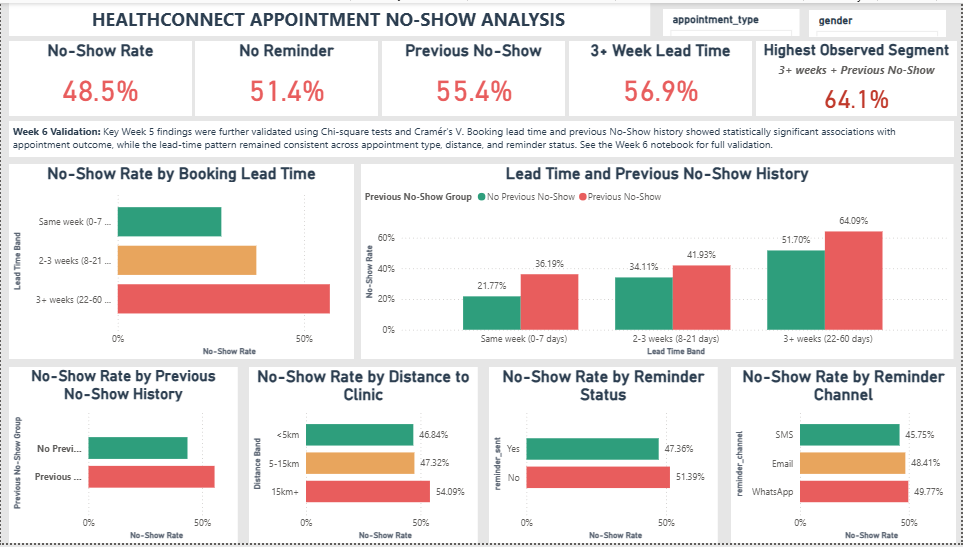
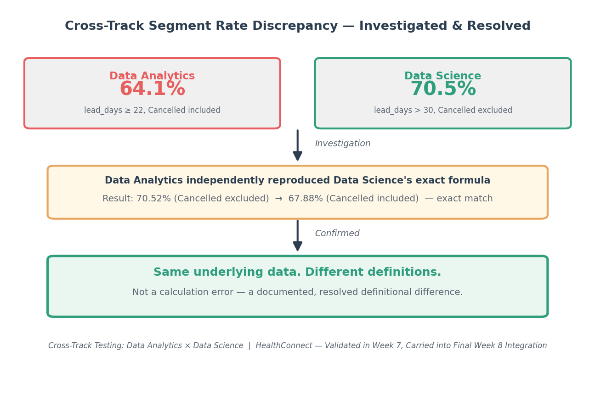

# HealthConnect — Week 8 Final Integration & Decision Support


## Project Overview

**HealthConnect** is a multidisciplinary healthcare analytics project focused on understanding missed appointments and supporting improvements in the patient support experience.

As part of the **Data Analytics track**, I analysed the HealthConnect appointment dataset, validated key findings, developed a Power BI decision-support dashboard, performed testing and refinement, and contributed analytical findings to the final multidisciplinary HealthConnect solution.

Week 8 focused on **final integration, validation, presentation preparation, and communicating the Data Analytics contribution within the wider HC-POD solution.**

---

## My Data Analytics Contribution

My contribution focused on:

- Analysing the HealthConnect appointment dataset
- Assessing data quality and preparing the data for analysis
- Investigating factors associated with appointment No-Shows
- Developing and validating KPIs
- Performing statistical validation
- Creating a Power BI decision-support dashboard
- Testing dashboard calculations, visuals, and filters
- Refining dashboard presentation and functionality
- Conducting cross-track validation with Data Science
- Developing business insights and recommendations
- Preparing the Data Analytics contribution for final HC-POD integration

---

## Dataset

The HealthConnect appointment dataset contains:

- **5,000 appointment records**
- **18 variables**

Key variables analysed included:

- Booking lead time
- Previous No-Show history
- Distance to clinic
- Reminder status
- Reminder channel
- Appointment type
- Gender
- Appointment outcome

The **HealthConnect Data Dictionary** was used to understand the variables and their definitions.

---

## Final KPIs

The final dashboard contains five validated KPI measures:

| KPI | Result |
|---|---:|
| Overall No-Show Rate | **48.5%** |
| No Reminder | **51.4%** |
| Previous No-Show | **55.4%** |
| 3+ Week Lead Time | **56.9%** |
| Highest Observed Segment | **64.1%** |

The **64.1% Highest Observed Segment** is specifically defined as:

> 3+ weeks (≥22 days) booking lead time + Previous No-Show, with all appointment outcomes included.

Segment definitions and denominator rules are explicitly documented to prevent ambiguity when comparing rates.

---

## Key Validated Findings

The analysis identified several important observed patterns:

- Longer booking lead times were associated with higher observed No-Show Rates.
- Previous No-Show history was associated with higher observed No-Show Rates.
- Combining booking lead time and previous No-Show history provided clearer separation between appointment segments.
- Reminder patterns showed differences across reminder status and channels, although these results are observational.
- Distance to the clinic provided an additional factor for understanding appointment outcomes.

### Key Analytical Finding



### Statistical Validation — Effect Size Comparison



Booking lead time, previous No-Show history, and their combination were each statistically validated using Chi-square tests and Cramér's V. The combined factor showed the largest effect size (0.189) among the relationships tested, indicating a stronger observed association than either factor individually.

---

## Statistical Validation

Key analytical relationships were tested statistically.

### Booking Lead Time

- χ² = **280.09**
- p < **0.0001**
- Cramér's V = **0.167**

### Previous No-Show History

- χ² = **69.86**
- p < **0.0001**
- Cramér's V = **0.118**

### Combined Lead Time × Previous No-Show

- χ² = **358.52**
- p < **0.0001**
- Cramér's V = **0.189**

These results indicate statistically significant associations within the analysed dataset. They do not establish causation.

---

## Final Power BI Dashboard

The final Power BI dashboard contains:

- **5 KPI cards**
- **6 comparison visuals**
- **2 slicers**
  - Appointment Type
  - Gender

The dashboard focuses on:

1. No-Show Rate by Booking Lead Time
2. No-Show Rate by Previous No-Show History
3. No-Show Rate by Distance to Clinic
4. No-Show Rate by Reminder Status
5. No-Show Rate by Reminder Channel
6. Lead Time × Previous No-Show

### Dashboard Preview



### Dashboard Refinement

During Week 7 testing, the Lead Time Band categories were found to require chronological sorting.

A dedicated **Lead Time Band Sort** column was created using `booking_lead_days`.

The affected visuals were subsequently re-tested and confirmed to display:

1. Same week (0–7 days)
2. 2–3 weeks (8–21 days)
3. 3+ weeks (22–60 days)

---

## Cross-Track Validation

A meaningful cross-track validation activity was completed with the **Data Science track**.

The collaboration focused on a discrepancy between previously reported Lead Time × Previous No-Show segment rates.

Data Analytics reported **64.1%**, while Data Science reported **70.5%**. Rather than assuming a calculation error, the segment definitions and denominator rules were independently investigated and reproduced.

Data Science's exact segment definition was:

- `booking_lead_days > 30`
- `previous_no_shows >= 1`

The Data Analytics track independently reproduced the calculation:

| Denominator | No-Show Rate |
|---|---:|
| Cancelled excluded | **70.52%** |
| Cancelled included | **67.88%** |

The validation confirmed that the difference was associated with different **lead-time thresholds and denominator definitions**, rather than an error in reproducing the Data Science calculation.

### Cross-Track Validation Evidence


---

## Final End-to-End Integration

The final HealthConnect solution brings together:

**Problem → Data → Analytics → Predictive Modelling → ML Engineering → GenAI → Project Management → Final Solution**

The Data Analytics track contributes the evidence and decision-support layer through:

- Validated KPIs
- Analytical findings
- Power BI dashboard
- Business insights
- Recommendations
- Testing and validation evidence
- Analytical limitations

These outputs connect with the predictive, technical, GenAI, and project-management components of the wider multidisciplinary HealthConnect solution.

---

## Business Insights

The analysis identified several important observed patterns:

- Longer booking lead times were associated with higher observed No-Show Rates.
- Previous No-Show history was associated with higher observed No-Show Rates.
- Combining lead time and previous No-Show history provided clearer separation between appointment segments.
- Reminder patterns showed differences across reminder status and channels, although these results are observational.
- Distance to the clinic provided an additional factor for understanding appointment outcomes.

---

## Recommendations

Based on the validated analysis, HealthConnect could consider:

1. Providing additional appointment support for longer-lead-time appointments.
2. Considering previous No-Show history when identifying appointments that may require additional support.
3. Using combined lead-time and previous-history segmentation as a decision-support approach.
4. Continuing to monitor reminder patterns and evaluating their effectiveness through further testing.
5. Using the Power BI dashboard to monitor appointment patterns and support decision-making.

These recommendations are based on observed relationships and should be validated further before being treated as evidence of real-world intervention effectiveness.

---

## Testing & Final Validation

The final Data Analytics outputs were tested across:

- KPI calculations
- Dashboard visuals
- Appointment Type slicer
- Gender slicer
- Combined Lead Time × Previous No-Show analysis
- Lead Time Band ordering
- Cross-track segment calculations

The dashboard refinement was successfully re-tested, and the final analytical outputs were prepared for HC-POD integration and presentation.

---

## Limitations

- The HealthConnect dataset is **synthetic**.
- The analysis identifies **associations rather than causation**.
- Some subgroup analyses contain relatively small sample sizes.
- Some variables contain missing values.
- Different segment definitions and denominator rules can produce different reported rates.
- Reminder analysis is observational.
- Analytical findings do not by themselves establish predictive performance.
- Dashboard testing covered the tested configurations and does not guarantee behaviour under every possible future data state.

---

## Tools Used

- **Python**
- **Pandas**
- **Statistical Analysis**
- **Power BI**
- **Microsoft Excel** where applicable
- **Jupyter Notebook**

---

## Project Structure

```text
week-8-final-integration/
│
├── notebook/
│   └── HealthConnect_week_8_final_integration.ipynb
│
├── report/
│   └── HealthConnect_week_8_project_summary.pdf
│
├── screenshots/
│   ├── final_dashboard.png
│   ├── lead_time_previous_no_show.png
│   ├── effect_size_validation.png
│   └── cross_track_validation.png
│
├── supporting-files/
│   └── HealthConnect_week_8_dashboard.pbix
│
└── README.md
```

---

## Connect With Me

- **GitHub:** [01Yusufh](https://github.com/01Yusufh)
- **LinkedIn:** [Hudu Yusuf Ibrahim](https://www.linkedin.com/in/hudu-yusuf-ibrahim-ba06b5365)
