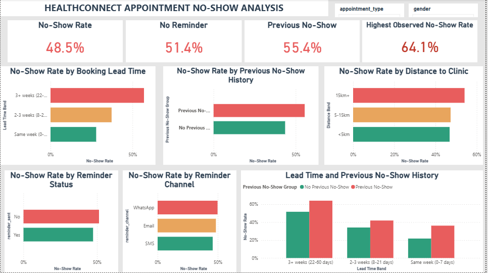

# HealthConnect Appointment No-Show Analysis


## 📌 Project Overview

This project analyses appointment attendance patterns using the **HealthConnect Appointment Dataset** as part of the **AnalystLab Africa — HealthConnect Experience Lab**.

The Week 5 Data Analytics work focuses on understanding factors associated with appointment **No-Shows**, including:

- Booking lead time
- Previous No-Show history
- Reminder status and reminder channel
- Distance to clinic
- Appointment type
- Gender

The analysis was performed using **Python and Pandas**, with the key findings translated into an interactive **Power BI dashboard**.

> **Note:** The HealthConnect dataset is synthetic. Therefore, the findings represent patterns within the provided dataset and should not be treated as real-world clinical benchmarks or causal conclusions.

---

## 🎯 Project Objective

The main objective is to identify and communicate patterns associated with appointment No-Shows and provide data-driven insights that can support further investigation and decision-making.

### Business Questions

The analysis focuses on the following questions:

1. What factors are most associated with appointment No-Shows?
2. Does reminder status or reminder channel show differences in No-Show rates?
3. Does booking lead time affect observed No-Show rates?
4. Do patients with a history of No-Shows show the same pattern again?
5. Does distance to the clinic relate to appointment attendance?
6. Do appointment type and gender show meaningful differences in No-Show rates?

---

## 📊 Dataset

The analysis uses the following HealthConnect files:

- `HealthConnect_Appointment_Data.csv`
- `HealthConnect_Data_Dictionary.csv`

### Dataset Overview

| Attribute | Details |
|---|---|
| Records | 5,000 |
| Columns | 18 |
| Outcome categories | Attended, No-Show, Cancelled |
| Main analysis | Appointment No-Show patterns |
| Dataset type | Synthetic |

### Key Fields

Some of the main fields used in the analysis include:

- `appointment_id`
- `patient_id`
- `gender`
- `age`
- `age_group`
- `appointment_type`
- `booking_date`
- `appointment_date`
- `booking_lead_days`
- `previous_appointments`
- `previous_no_shows`
- `reminder_sent`
- `reminder_channel`
- `distance_to_clinic_km`
- `appointment_outcome`

---

## 🧹 Data Preparation & Quality Checks

The dataset was reviewed and validated before analysis.

The preparation process included:

- Checking dataset dimensions and data types
- Converting date fields to datetime format
- Checking for duplicate appointment IDs
- Reviewing missing values
- Checking categorical values for consistency
- Validating logical relationships between variables
- Checking booking lead-time calculations
- Reviewing possible data-quality limitations

### Missing Values

| Column | Missing Values | Percentage | Interpretation |
|---|---:|---:|---|
| `reminder_channel` | 1,366 | 27.3% | Structural missingness where no reminder was sent |
| `distance_to_clinic_km` | 90 | 1.8% | Missing |
| `waiting_time_minutes` | 60 | 1.2% | Missing |

No duplicate `appointment_id` values were identified.

---

## 📈 Key KPIs

Five main KPIs were selected for the analysis:

1. **Overall No-Show Rate**
2. **No-Show Rate by Reminder Status and Channel**
3. **No-Show Rate by Booking Lead Time**
4. **No-Show Rate by Previous No-Show History**
5. **No-Show Rate by Distance to Clinic**

A combined analysis of **Booking Lead Time × Previous No-Show History** was also performed to examine how the two characteristics varied together.

---

## 🔎 Key Findings

### 1. Booking Lead Time Shows the Largest Observed Difference

No-Show rates increased as booking lead time became longer:

| Booking Lead Time | No-Show Rate |
|---|---:|
| Same week (0–7 days) | **27.8%** |
| 2–3 weeks (8–21 days) | **37.2%** |
| 3+ weeks (22–60 days) | **56.9%** |

This represents a **29.1 percentage-point difference** between the shortest and longest booking lead-time groups.

---

### 2. Previous No-Show History Is Associated With Higher No-Shows

| Previous No-Show History | No-Show Rate |
|---|---:|
| No previous No-Show | **43.5%** |
| Previous No-Show | **55.4%** |

Appointments involving patients with previous No-Show history had an observed No-Show rate **11.9 percentage points higher**.

---

### 3. Combined Lead Time and Previous No-Show History

The combined analysis showed an even wider observed difference:

| Lead Time | Previous No-Show History | No-Show Rate |
|---|---|---:|
| Same week | No | **21.8%** |
| Same week | Yes | **36.2%** |
| 2–3 weeks | No | **34.1%** |
| 2–3 weeks | Yes | **41.9%** |
| 3+ weeks | No | **51.7%** |
| 3+ weeks | Yes | **64.1%** |

The highest observed segment was **3+ week booking lead time with previous No-Show history**, at **64.1%**.

This is an observed segment rate, not a predictive risk score.

---

### 4. Distance Shows a Smaller but Noticeable Difference

| Distance Band | No-Show Rate |
|---|---:|
| <5 km | **46.5%** |
| 5–15 km | **47.3%** |
| 15 km+ | **54.1%** |

Appointments 15 km or more from the clinic had a **7.6 percentage-point higher** observed No-Show rate than appointments less than 5 km away.

---

### 5. Reminder Status Shows a Smaller Difference

| Reminder Status | No-Show Rate |
|---|---:|
| Reminder sent | **47.4%** |
| No reminder | **51.4%** |

The observed difference was **4.0 percentage points**.

This does not establish that reminders cause patients to attend. Other factors may influence the difference.

---

### 6. Reminder Channel Shows Some Variation

Among appointments where a reminder was sent:

| Reminder Channel | No-Show Rate |
|---|---:|
| SMS | **45.8%** |
| Email | **48.4%** |
| WhatsApp | **49.8%** |

The differences between channels were relatively small, so the analysis does not establish that one channel is more effective than another.

---

### 7. Appointment Type and Gender Show Limited Differences

No-Show rates by appointment type ranged from **46.6%** to **51.2%**.

Female and Male groups also showed very similar No-Show rates:

- Female: **48.4%**
- Male: **48.7%**

The "Prefer not to say" group had a No-Show rate of **43.5%**, but it contains only 108 records, so this result should be interpreted cautiously.

---

## 💡 Business Recommendations

Based on the observed patterns, the following areas are recommended for further investigation:

### 1. Pay Attention to Longer Booking Lead Times

Appointments booked several weeks in advance showed higher observed No-Show rates.

A clinic could investigate whether additional confirmation or reminder activity closer to the appointment date may help reduce missed appointments.

### 2. Consider Previous No-Show History

Patients with previous No-Show history showed a higher observed No-Show rate.

This characteristic could therefore be considered when prioritising appointment confirmation efforts, subject to validation with real-world data.

### 3. Investigate the Highest Observed Segment

The combination of:

**Previous No-Show History + 3+ Week Booking Lead Time**

had the highest observed No-Show rate at **64.1%**.

This segment could receive particular attention during further investigation.

### 4. Investigate Distance-Related Barriers

The higher observed No-Show rate among appointments 15 km+ from the clinic suggests that distance may be worth investigating as a potential operational factor.

### 5. Continue Monitoring Reminder Patterns

Reminder status and channel showed differences in No-Show rates, although the analysis does not establish causation.

Further analysis using real-world data or controlled testing would be required before concluding that a particular reminder approach is more effective.

---

## 📊 Power BI Dashboard

The Python analysis was translated into an initial Power BI dashboard.

The dashboard includes:

- Overall No-Show Rate
- No-Show Rate by Booking Lead Time
- No-Show Rate by Previous No-Show History
- No-Show Rate by Distance to Clinic
- No-Show Rate by Reminder Status
- No-Show Rate by Reminder Channel
- Booking Lead Time × Previous No-Show History
- Appointment Type slicer
- Gender slicer

### Dashboard Preview




---

## 🧪 Tools & Technologies

### Python
- Python
- Pandas
- Jupyter Notebook

### Business Intelligence
- Microsoft Power BI
- DAX

### Version Control
- Git
- GitHub

---

## 📁 Project Structure

```text
healthConnect-appointment-analysis-2/
│
├── data/
│   ├── HealthConnect_Appointment_Data.csv
│   └── HealthConnect_Data_Dictionary.csv
│
├── notebook/
│   └── 02_initial_analysis.ipynb
│
├── power-bi/
│   └── HealthConnect_No_Show_Analysis.pbix
│
│─── report/
│     └── project_summary.pdf
├── screenshots/
│   └── powerbi_dashboard.png
│
└── README.md
```

---

## 👤 Author

**Hudu Yusuf Ibrahim**

- GitHub: [github.com/01Yusufh](https://github.com/01Yusufh)
- LinkedIn: [linkedin.com/in/hudu-yusuf-ibrahim-ba06b5365](https://www.linkedin.com/in/hudu-yusuf-ibrahim-ba06b5365)
