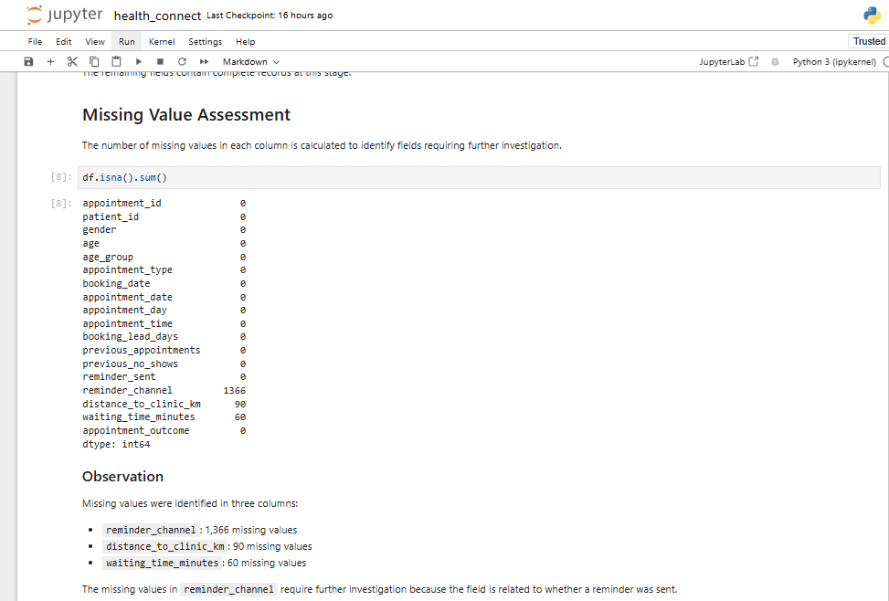
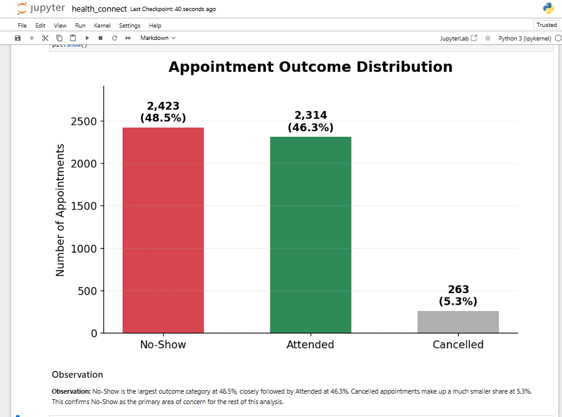
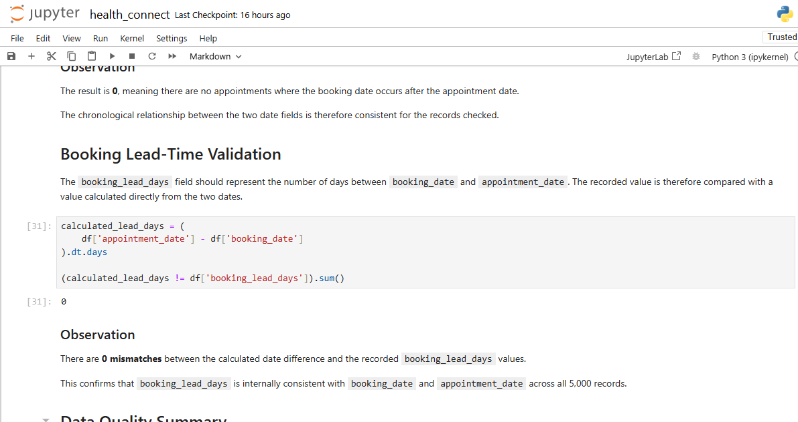

# 🏥 HealthConnect Appointment Data — Initial Analysis

**AnalystLab Africa — HealthConnect Experience Lab**

**Week 4: Initial Analysis | Data Analytics Track**

Prepared by **Hudu Yusuf Ibrahim**

---

## 📌 Project Overview

This project is part of the **AnalystLab Africa — HealthConnect Experience Lab**.

The Week 4 objective was to develop a strong understanding of the HealthConnect appointment dataset and establish the foundation for investigating appointment no-shows.

The initial analysis focused on:

- Understanding the structure of the dataset
- Inspecting data types and records
- Identifying missing values
- Checking duplicate appointment IDs
- Validating logical relationships between fields
- Understanding appointment outcomes
- Identifying relevant business questions
- Defining potential KPIs for the next phase of analysis

The findings from this initial assessment will guide the deeper analysis and Power BI dashboard development planned for Week 5.

---

## 🎯 Problem Statement

Missed appointments can affect clinic operations by reducing the effective use of appointment slots and making scheduling more difficult.

The purpose of this project is to investigate which patient, booking, reminder, and logistical factors are associated with appointment no-shows.

At this stage, the analysis is **descriptive and correlational**. The dataset does not support causal conclusions about why patients miss appointments.

---

## 📊 Dataset

The analysis uses two files:

### `HealthConnect_Appointment_Data.csv`

The dataset contains:

- **5,000 appointment records**
- **18 fields**

The fields cover:

- Patient demographics
- Appointment information
- Booking information
- Previous appointment history
- Reminder information
- Distance to clinic
- Waiting time
- Appointment outcome

### `HealthConnect_Data_Dictionary.csv`

The data dictionary was used to understand the meaning of the fields and review the stated constraints before analysis.

---

## 🔎 Week 4 Initial Findings

### Dataset Structure

- 5,000 records
- 18 columns
- No duplicate `appointment_id` values
- No violations of the logical constraints checked during the initial assessment

### Appointment Outcomes

| Outcome | Count | Percentage |
|---|---:|---:|
| No-Show | 2,423 | 48.5% |
| Attended | 2,314 | 46.3% |
| Cancelled | 263 | 5.3% |

The **48.5% No-Show proportion** is a notable characteristic of this synthetic dataset and should not be assumed to represent real-world clinic attendance patterns.

---

## 📸 Analysis Highlights

A few highlights from the Python analysis are shown below. The complete notebook, including code, Markdown explanations, and outputs, is available in the repository.

### 1. Missing Value Investigation



Shows the missing-value count across the dataset, flagging `reminder_channel` as needing further investigation given its likely link to reminder status. This is validated in a later step of the notebook, which confirms the missingness is structural rather than random.


### 2. Appointment Outcome Distribution



A visual breakdown of No-Show, Attended, and Cancelled appointments, highlighting the high proportion of missed appointments driving this project.

### 3. Booking Lead Time Validation



Shows the independent validation of `booking_lead_days` against the calculated difference between `appointment_date` and `booking_date`, confirming the field is reliable for later analysis.

---

## 📓 Full Analysis Notebook

The complete Python analysis — including the dataset overview, data quality assessment, appointment outcomes, reminder analysis, and validation checks — is available below:

👉 [**View the full analysis notebook**](notebook/01_initial_analysis.ipynb)

GitHub can render `.ipynb` files directly, allowing the analysis to be reviewed in the browser.

---

## 🧹 Data Quality Findings

Three fields contain missing values:

| Field | Missing Values | Percentage | Initial Handling |
|---|---:|---:|---|
| `reminder_channel` | 1,366 | 27.3% | Structural missingness; retain as blank |
| `distance_to_clinic_km` | 90 | 1.8% | Exclude only from distance-specific analysis |
| `waiting_time_minutes` | 60 | 1.2% | Exclude only from waiting-time-specific analysis |

### Reminder Channel

All **1,366 records where `reminder_sent = "No"`** have a missing `reminder_channel`.

This indicates that the missing values are structurally related to the reminder status rather than representing a missing communication channel that should be imputed.

### Logical Validation

The following checks were performed:

- `previous_no_shows` does not exceed `previous_appointments`
- `booking_date` does not occur after `appointment_date`
- `booking_lead_days` matches the difference between `booking_date` and `appointment_date`

All three checks returned **0 violations or mismatches**.

---

## ❓ Business Questions

The analysis will investigate the following questions:

1. What factors are most associated with appointment no-shows, including age, distance to the clinic, appointment type, booking lead time, and previous no-show history?

2. Does sending a reminder relate to attendance, and does the reminder channel used make a difference?

3. Does booking lead time relate to the likelihood of a no-show?

4. Are patients with a history of previous no-shows more likely to miss future appointments, or is no-show behaviour largely one-off?

5. Does distance to the clinic relate to attendance, and could this inform outreach, reminders, or scheduling decisions?

---

## 📈 Potential KPIs

The following KPIs were identified for the next phase of analysis:

| KPI | Linked Question | Purpose |
|---|---|---|
| Overall No-Show Rate | Q1 | Establish the baseline no-show level |
| No-Show Rate by Reminder Status / Channel | Q2 | Examine the relationship between reminders and attendance |
| No-Show Rate by Booking Lead Time Band | Q3 | Examine whether booking lead time is associated with no-shows |
| No-Show Rate Among Patients With Previous No-Shows | Q4 | Compare patients with previous no-shows against those without previous no-show history |
| No-Show Rate by Distance Band | Q5 | Examine whether distance is associated with attendance |

> **Note:** These KPIs were identified during Week 4 but were not calculated or visualised at this stage.

---

## 🛠️ Tools & Technologies

- **Python**
- **Pandas**
- **Jupyter Notebook**
- **Power BI** — planned for the next phase
- **GitHub** — project documentation and portfolio

---

## 📁 Project Structure

```text
healthconnect-appointment-analysis/
│
├── dataset/
│   ├── HealthConnect_Appointment_Data.csv
│   └── HealthConnect_Data_Dictionary.csv
│
├── notebook/
│   └── 01_initial_analysis.ipynb
│
├── documentation/
│   ├──initial_analysis.pdf
│   └── project_summary.pdf
│
├── screenshots/
│   ├── 01_missing_values.png
│   ├── 02_outcome_distribution.png
│   └── 03_lead_time_validation.png
│
└── README.md
```

---

## 👤 Author

**Hudu Yusuf Ibrahim**

- GitHub: [github.com/01Yusufh](https://github.com/01Yusufh)
- LinkedIn: [linkedin.com/in/hudu-yusuf-ibrahim-ba06b5365](https://www.linkedin.com/in/hudu-yusuf-ibrahim-ba06b5365)

