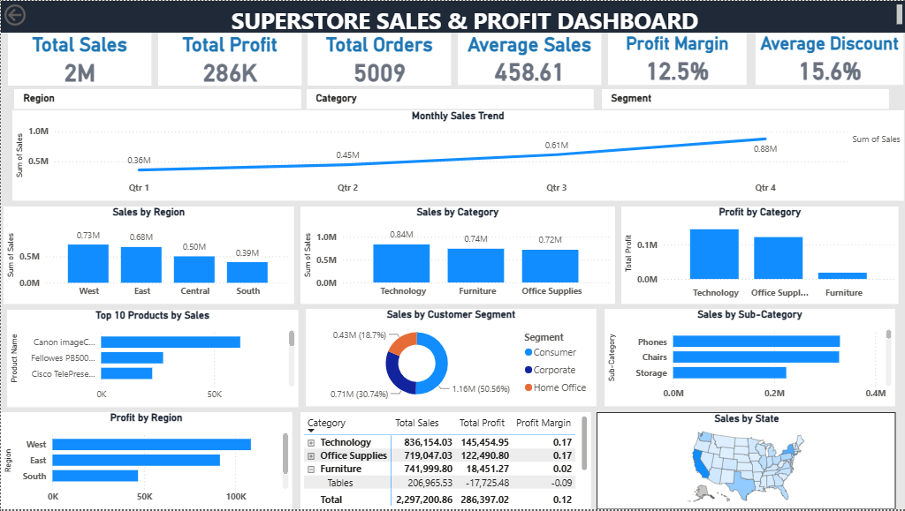
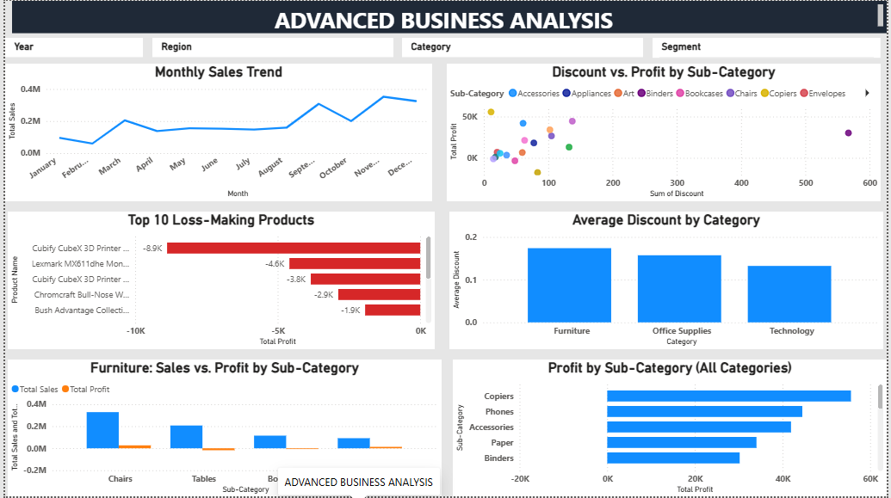

# 📊 Superstore Sales & Profit Dashboard


---

## 📌 Project Overview

This project focuses on building an interactive **Superstore Sales & Profit Dashboard** using Microsoft Power BI, developed across two stages of the AnalystLab Africa Data Analytics Internship.

- **Week 2** — Built the core executive dashboard with KPIs, category, regional, customer, product, and profitability analysis.
- **Week 3** — Extended the project with deeper analysis, including monthly sales trends, discount analysis, product-level loss investigation, and three formally investigated business problems.

The dashboard was developed to help management monitor sales performance, profitability, customer behavior, product performance, and regional performance, enabling more informed and data-driven business decisions.

The project simulates the operations of a national retail company using the **Superstore dataset**.

---

## 🎯 Business Objective

The main objective of this project is to develop an executive and advanced analytical dashboard that enables management to:

- Monitor overall sales and profitability.
- Identify high- and low-performing product categories.
- Analyze regional sales performance.
- Understand customer segment contribution.
- Identify top-performing and loss-making products.
- Monitor sales trends over time, including monthly and seasonal patterns.
- Compare sales and profitability across categories and regions.
- Investigate the relationship between discounting and profitability.
- Identify potential business risks and growth opportunities.
- Support data-driven business decisions and resource allocation.

---

## 🧰 Tools & Technologies

- **Microsoft Power BI**
- **Power Query**
- **DAX**
- **Data Visualization**
- **Data Cleaning & Transformation**
- **Microsoft Excel / CSV Dataset**

---

## 💡 Skills Demonstrated

- Data cleaning and transformation
- Power Query
- DAX measure development
- KPI development
- Data visualization
- Time-series analysis
- Discount and profitability analysis
- Business problem investigation
- Business insights generation
- Risk and opportunity identification
- Data-driven recommendations
- Dashboard design and storytelling

---

## 📊 Dashboard Features

The dashboard is built across two pages.

### Page 1 — Executive Overview

#### KPI Cards

- Total Sales
- Total Profit
- Total Orders
- Average Sales per Order
- Profit Margin
- Average Discount

#### Visualizations

- Sales by Region
- Sales by Category
- Quarterly Sales Trend
- Profit by Category
- Top 10 Products by Sales
- Sales by Customer Segment
- Profit by Region
- Sales by Sub-Category
- Sales by State (Map)
- Category / Sub-Category Profit Matrix

#### Interactive Filters

- Region
- Category
- Customer Segment

---

### Page 2 — Advanced Business Analysis

Week 3 introduced a second analytical page focused on deeper investigation.

#### Visualizations

- Monthly Sales Trend
- Discount vs. Profit by Sub-Category
- Top 10 Loss-Making Products
- Average Discount by Category
- Furniture: Sales vs. Profit by Sub-Category
- Profit by Sub-Category (All Categories)

#### Interactive Filters

- Year
- Region
- Category
- Customer Segment

---

## 🧮 DAX Measures

| Measure | Formula | Purpose |
|---|---|---|
| **Total Sales** | `SUM(superstore[Sales])` | Calculates total revenue generated across the dataset. |
| **Total Profit** | `SUM(superstore[Profit])` | Calculates total profit generated across all transactions. |
| **Total Orders** | `DISTINCTCOUNT(superstore[Order ID])` | Counts unique orders while avoiding overcounting multiple product line items within the same order. |
| **Average Sales per Order** | `DIVIDE([Total Sales], [Total Orders], 0)` | Calculates the average revenue generated per unique order. |
| **Profit Margin** | `DIVIDE([Total Profit], [Total Sales], 0)` | Measures profitability as a percentage of total sales. |
| **Average Discount** | `AVERAGE(superstore[Discount])` | Calculates the average discount rate applied across sales transactions and supports the investigation of discounting and profitability. |

### Measure Design Notes

- **Total Orders** uses `DISTINCTCOUNT` rather than `COUNT` because the Superstore dataset stores product line items as individual rows. A single order can therefore appear across multiple rows.
- **Average Sales per Order** uses `DIVIDE([Total Sales], [Total Orders], 0)` rather than `AVERAGE(Sales)` because averaging the raw Sales column would calculate average line-item sales rather than average order value.
- **DIVIDE()** is used for ratio calculations to safely handle potential divide-by-zero situations.

---

## 🔍 Key Business Insights

### 1. West is the strongest sales region

The West region generated approximately **$0.73M in sales**, making it the strongest-performing region, while the South generated approximately **$0.39M**.

### 2. Technology is the strongest-performing category

Technology generated approximately **$0.84M in sales** and **$145K in profit**, with an approximately **17% profit margin**.

### 3. Furniture generates substantial sales but low profit

Furniture generated approximately **$0.74M in sales**, but only around **$18K in profit**, resulting in an approximately **2% margin**. The **Tables** sub-category operates at a negative margin of approximately **-9%**.

### 4. Consumer customers are the largest segment

The Consumer segment generated approximately **$1.16M**, representing about **50.6% of total sales**.

### 5. Losses are concentrated in specific products

The Top 10 Loss-Making Products analysis identifies specific products generating significant losses, with the leading loss-making product contributing approximately **-$8.9K**.

---

## 🔎 Business Problems Investigated

### Problem 1 — Why does Furniture have high sales but low profit?

Furniture generates substantial sales but significantly lower profit than Technology and Office Supplies.

The Furniture deep-dive shows that **Tables and other Furniture sub-categories have weak profitability despite generating meaningful sales**. Furniture also has the highest average discount among the three major categories.

The dashboard therefore suggests that **higher discounting is associated with Furniture's weak margins**, although discounting should be considered alongside other factors such as product costs and pricing.

---

### Problem 2 — Which months drive the strongest and weakest sales?

The monthly sales analysis shows that sales generally strengthen toward the end of the year.

**September through December** show particularly strong performance, with November and December among the strongest months in the analysis.

January and February are comparatively weaker.

This indicates a potential **seasonal demand pattern** that management can consider when planning inventory, marketing, and resources.

---

### Problem 3 — How are discounts affecting profitability?

The Discount vs. Profit analysis shows differences in profitability across sub-categories with different discount levels.

The dashboard suggests that **higher discounting can be associated with weaker profitability**, particularly in some Furniture sub-categories.

However, the analysis shows an association rather than proving that discounting is the sole cause of lower profit.

---

## ⚠️ Business Risks

### 1. Furniture margin pressure

Furniture has relatively low profitability despite substantial sales. High discount levels, particularly within weaker sub-categories such as Tables, could continue to put pressure on margins.

### 2. Regional performance imbalance

The West and East regions contribute substantially more sales than the South, creating a performance imbalance that could expose the business to regional concentration risk.

### 3. Customer segment concentration

The Consumer segment contributes approximately **50.6% of total sales**. Heavy dependence on one customer segment could create risk if Consumer demand weakens.

---

## 🚀 Business Opportunities

- **Expand investment in Technology**, which demonstrates strong sales and profitability.
- **Improve Furniture profitability** by reviewing discount structures, pricing, and product-level performance.
- **Improve South region performance** through further analysis of customer demand, pricing, product mix, and marketing.
- **Use seasonal demand patterns** to optimize inventory and marketing ahead of stronger Q4 demand.
- **Review loss-making products** to identify opportunities for repricing, supplier negotiation, product replacement, or discontinuation.

---

## 💡 Recommendations

Based on the dashboard findings, management should consider the following actions:

### 1. Increase investment in Technology

Prioritize high-performing Technology products through inventory availability, targeted marketing, and continued product development.

### 2. Review and restructure Furniture discounts

Review discount policies for Furniture, particularly **Tables and Chairs**, and consider minimum-margin thresholds before approving large discounts.

### 3. Plan resources around seasonal demand

Use the stronger September–December sales period to improve inventory planning, staffing, marketing campaigns, and promotional activities.

### 4. Investigate individual loss-making products

Review the products identified in the Top 10 Loss-Making Products analysis. Management should examine their pricing, discount levels, product costs, and demand before deciding whether to reprice, renegotiate, replace, or discontinue them.

### 5. Develop a strategy for the South region

Conduct further analysis of customer demand, product mix, pricing, and marketing effectiveness in the South region to identify the causes of its lower sales performance.

### 6. Strengthen customer segment diversification

Continue retaining Consumer customers while developing strategies to increase engagement and sales from the **Corporate** and **Home Office** segments.

---

## 📈 Dashboard Preview

### Page 1 — Executive Overview



### Page 2 — Advanced Business Analysis



---

## 📁 Repository Structure

```text
```text
superstore-sales-profit-dashboard/
│
├── superstore-power-bi.pbix
│
├── screenshots/
│   ├── dashboard_page1.png
│   └── dashboard_page2.png
│
├── reports/
│   ├── bi_overview_report.pdf
│   ├── business_insights_recommendations.pdf
│   ├── dax_measures_documentation.pdf
│   
│
└── README.md
---

## 👤 Author

**Hudu Yusuf Ibrahim**

🔗 **LinkedIn:** [linkedin.com/in/hudu-yusuf-ibrahim-ba06b5365](https://www.linkedin.com/in/hudu-yusuf-ibrahim-ba06b5365)

💻 **GitHub:** [github.com/01Yusufh](https://github.com/01Yusufh)