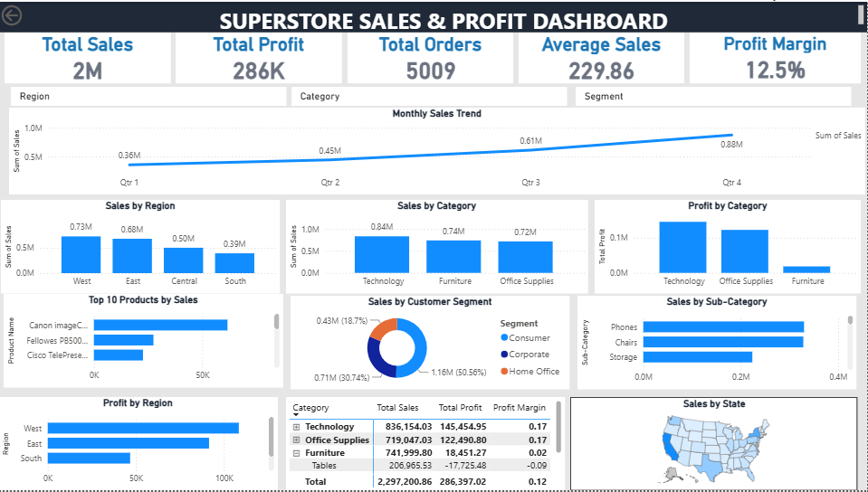

# 📊 Superstore Sales & Profit Dashboard

## 📌 Project Overview

This project focuses on building an interactive **Superstore Sales & Profit Dashboard** using Microsoft Power BI.

The dashboard was developed to help management monitor sales performance, profitability, customer behavior, product performance, and regional performance, enabling more informed and data-driven business decisions.

The project simulates the operations of a national retail company using the Superstore dataset.

---

## 🎯 Business Objective

The main objective of this project is to develop an executive dashboard that enables management to:

- Monitor overall sales and profitability.
- Identify high- and low-performing product categories.
- Analyze regional sales performance.
- Understand customer segment contribution.
- Identify top-performing products.
- Monitor sales trends over time.
- Compare sales and profitability across categories and regions.
- Identify potential business risks and growth opportunities.

---

## 🧰 Tools & Technologies

- **Microsoft Power BI**
- **Power Query**
- **DAX**
- **Data Visualization**
- **Data Cleaning & Transformation**
- **Microsoft Excel / CSV Dataset**

---

## 📊 Dashboard Features

The dashboard includes:

### KPI Cards

- Total Sales
- Total Profit
- Total Orders
- Average Sales
- Profit Margin

### Visualizations

- Sales by Region
- Sales by Category
- Monthly Sales Trend
- Profit by Category
- Top 10 Products by Sales
- Sales by Customer Segment
- Profit by Region
- Sales by Sub-Category
- Sales by State Map
- Product Performance Matrix

### Interactive Filters

- Region
- Category
- Customer Segment

---

## 🔍 Key Business Insights

### 1. West is the strongest sales region

The West region generated approximately **$0.73M in sales**, making it the strongest-performing region, while the South generated approximately **$0.39M**.

### 2. Technology is the strongest-performing category

Technology generated approximately **$0.84M in sales** and **$145K in profit**, with an approximately **17% profit margin**.

### 3. Furniture generates substantial sales but low profit

Furniture generated approximately **$0.74M in sales**, but only around **$18K in profit**, resulting in an approximately **2% profit margin**.

The Tables sub-category is particularly concerning because it operates at a negative margin.

### 4. Consumer customers are the largest segment

The Consumer segment generated approximately **$1.16M**, representing about **50.6% of total sales**.

### 5. Product performance is uneven

The Top 10 Products analysis shows that some products generate substantially more sales than others, highlighting opportunities to optimize the product portfolio.

---

## ⚠️ Business Risks

- Heavy dependence on the Consumer customer segment.
- Low profitability in the Furniture category.
- Significant differences in regional sales performance.

---

## 🚀 Business Opportunities

- Expand investment in high-performing Technology products.
- Improve Furniture pricing, discounts, and product profitability.
- Investigate opportunities to improve performance in the South region.

---

## 💡 Recommendations

Based on the dashboard analysis, the following actions are recommended:

1. **Increase investment in the Technology category** by prioritizing high-performing products, inventory availability, and targeted marketing.

2. **Review Furniture pricing and discount strategies** to improve the category's low profit margin.

3. **Develop a strategy to improve South region performance** through further analysis of customer demand, product availability, pricing, and marketing.

4. **Strengthen Consumer customer retention** while developing Corporate and Home Office segments to reduce customer concentration risk.

5. **Optimize the product portfolio** by investing more in products with strong demand and profitability while reviewing weaker products.

---

## 📈 Dashboard Preview

---

## 👤 Author

**Hudu Yusuf Ibrahim**
🔗 LinkedIn: [linkedin.com/in/hudu-yusuf-ibrahim-ba06b5365](https://www.linkedin.com/in/hudu-yusuf-ibrahim-ba06b5365)
💻 GitHub: [github.com/01Yusufh](https://github.com/01Yusufh)