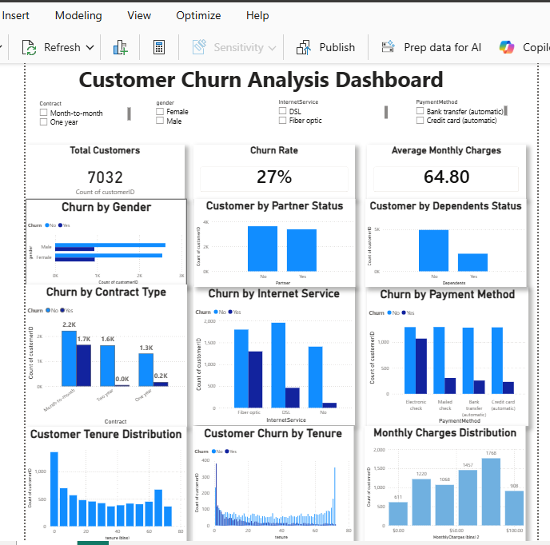
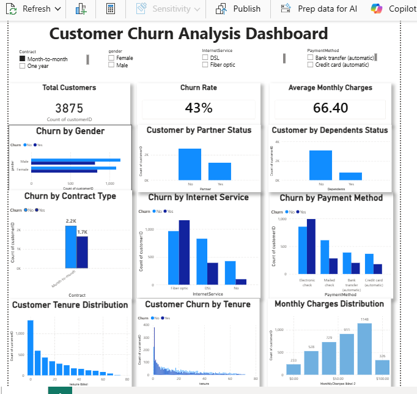

# 📊 Customer Churn Analysis Dashboard

## 📌 Project Overview

This project analyzes customer churn data using **Microsoft Power BI** to understand customer behavior, identify patterns associated with churn, and generate business insights that can support customer retention strategies.

The dashboard provides an interactive view of customer demographics, contract types, internet services, payment methods, customer tenure, and monthly charges.

---

## 🎯 Project Objectives

The main objectives of this project were to:

- Analyze overall customer churn.
- Calculate the customer churn rate.
- Understand customer demographics.
- Compare churn across different contract types.
- Analyze churn by internet service.
- Analyze churn by payment method.
- Examine customer tenure distribution.
- Analyze the distribution of monthly charges.
- Build an interactive Power BI dashboard for business reporting.

---

## 🛠️ Tools & Technologies

- **Microsoft Power BI**
- **Power Query** – Data preparation and transformation
- **DAX** – Measures and calculations
- **Data Visualization**
- **Business Intelligence**

---

## 📂 Dataset

The project uses the **Telco Customer Churn** dataset.

The dataset contains customer-level information including:

- Customer ID
- Gender
- Partner
- Dependents
- Tenure
- Contract
- Internet Service
- Payment Method
- Monthly Charges
- Churn

The dataset contains **7,032 customers** after data preparation.

---

## 📊 Dashboard Overview

The dashboard contains three key performance indicators:

- **Total Customers:** 7,032
- **Churn Rate:** 27%
- **Average Monthly Charges:** 64.80

### Customer Demographics

- Churn by Gender
- Customer by Partner Status
- Customer by Dependents Status

### Customer & Service Analysis

- Churn by Contract Type
- Churn by Internet Service
- Churn by Payment Method

### Tenure & Charges Analysis

- Customer Tenure Distribution
- Customer Churn by Tenure
- Monthly Charges Distribution

### Interactive Filters

Users can interact with the dashboard using slicers for:

- Contract
- Gender
- Internet Service
- Payment Method

---

## 🖼️ Dashboard Preview

### Dashboard Overview

The overview shows the customer churn dashboard using the complete dataset without any slicer selections.

### Interactive Dashboard

The dashboard can also be filtered using the available slicers. The example below shows the dashboard after applying a filter.

---

## 📈 Key Business Insights

- Approximately **27% of customers have churned**, indicating that customer retention is an important business concern.

- **Month-to-month contract customers** account for the largest number of churned customers compared with one-year and two-year contract customers.

- **Fiber optic customers** have a higher number of churned customers than DSL and customers without internet service.

- **Electronic check customers** show the highest number of churned customers. The dashboard shows **994 churned customers compared with 856 customers who did not churn** among electronic check users.

- Customers with **shorter tenure** are concentrated heavily in the early tenure ranges, while the distribution becomes lower across longer tenure periods.

- The customer base is concentrated across the **middle-to-high monthly charge ranges**, with the largest customer group appearing around the higher-middle charge range.

---

## 💡 Business Recommendations

Based on the analysis, the following actions could help improve customer retention:

1. **Focus on month-to-month customers**
   - Develop incentives that encourage customers to move to longer-term contracts.

2. **Investigate fiber optic customer churn**
   - Review pricing, service quality, customer experience, and support for fiber optic customers.

3. **Investigate electronic check customers**
   - Encourage customers to use automatic payment methods through convenient payment options or incentives.

4. **Focus on newer customers**
   - Strengthen onboarding, customer support, and engagement during the early stages of the customer relationship.

5. **Monitor customer charges**
   - Continue analyzing pricing and service packages to better understand customer behavior.

---

## 📚 Skills Demonstrated

Through this project, I practiced:

- Data cleaning and preparation
- Data transformation using Power Query
- DAX measures
- KPI creation
- Data visualization
- Interactive dashboard design
- Slicers and filtering
- Business analysis
- Extracting actionable insights from data
- Communicating data findings through visualizations

---

## 🎓 Learning Outcomes

This project helped me strengthen my understanding of:

- Building dashboards in Power BI
- Creating and formatting visualizations
- Writing DAX measures
- Using Power BI slicers and filters
- Analyzing customer churn patterns
- Turning data into business insights
- Designing a clear and user-friendly dashboard

---

## 🙏 Acknowledgements

This project was completed as part of my internship at Saiket Systems, as part of my ongoing Data Analytics learning journey. It gave me hands-on experience with data preparation, DAX calculations, interactive dashboard design, and translating raw data into business insights using Microsoft Power BI.

---

## 👨‍💻 Author

**Hudu Yusuf Ibrahim**

Aspiring Data Analyst passionate about using data to generate meaningful business insights.

- **GitHub:** [01Yusufh](https://github.com/01Yusufh)
- **LinkedIn:** [Hudu Yusuf Ibrahim](https://www.linkedin.com/in/hudu-yusuf-ibrahim-ba06b5365/)

---

## ⭐ Project Status

**Completed**

This is my first Power BI portfolio project and represents a practical application of data analytics and business intelligence skills.
